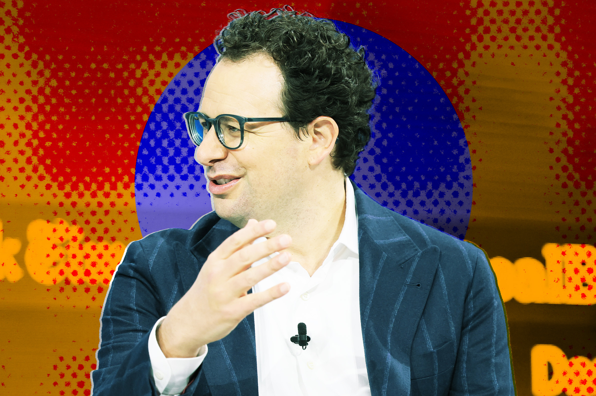

# Anthropic被用户起诉：高价订阅计划涉嫌欺诈，用量远低于宣传

> 一位愤怒的用户代表所有高阶订阅者将Anthropic告上法庭，称其Max系列套餐的实际使用额度远不及广告承诺，编程越勤快，"坑"越深。

## 正文

Anthropic Claude AI 的高价订阅计划正面临集体诉讼

花200美元买一个月AI编程订阅，结果几周就用完了额度？这不是个例。

本周一，用户卡尔·卡恩（Karl Kahn）向联邦法院提起诉讼，指控Claude AI的制造商Anthropic在"Max 5x"和"Max 20x"两个高端套餐上存在误导宣传，要求退还费用。这场官司由《华尔街日报》率先报道，折射出AI公司正在承受来自重度用户的不满——这些人用得多，看得也最清楚。

Anthropic已成为AI编程工具领域的第一选择。其入门级编程套餐Claude Pro每月仅需17至20美元，但重度编程用户则需要升级到Max系列：Max 5x每月100美元，宣称提供5倍于Pro的额度；Max 20x每月200美元，承诺20倍额度。听起来很划算，但诉讼指出，实际情况"远低于广告中承诺的数量"，指控该公司营销行为构成欺诈。

## 用户到底经历了什么？

卡恩发现，升级到Max 20x后短短几周就触达了周使用上限。一次仅五小时的编程会话，就用掉了当周额度的15%。他不得不被迫停止工作、精打细算地"配给"使用量，或者额外掏钱购买更多额度才能完成手头的任务。

问题出在哪里？编程是AI模型能执行的最密集任务之一。无论是"氛围编程"（vibe coding）爱好者还是专业软件工程师，都会同时运行多个AI编程代理连续数小时，月账单轻松上万。AI公司越来越严格地管控用量，转向按token计费的模式——用户消耗的计算资源越多，付得越多。

## 透明度的裂缝

这场官司的核心争议不在价格本身，而在于透明度。诉讼指出，AI公司并没有明确告知用户它们如何追踪和计算使用量。消费者以为自己买的是"5倍额度"，实际上拿到的可能连一半都不到。

在Reddit的r/ClaudeAI社区，这场诉讼引发了激烈讨论。有人支持卡恩，称自己也遇到了同样的"额度焦虑"；也有人反驳说，Max系列套餐的价值已经远超预期，起诉纯属小题大做。

分歧的背后是一个更深层的现实：当AI工具从尝鲜进入生产环境，从少数人的玩具变成开发者的日常伴侣，用户开始用真金白银投票。那些隐藏在漂亮广告文案后面的小字，终究会被人一条一条翻出来。

---

## 封面图

![[cover.jpg]]
