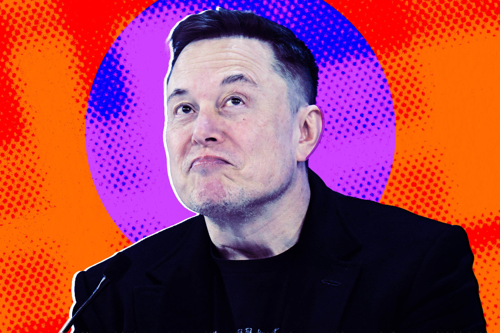

# SpaceX上市一周股价跌破173美元，散户狂欢之后市场开始"灵魂拷问"

> 万众瞩目的SpaceX IPO在经历首日暴涨后急速回落，股价较周二高点暴跌超20%，市场开始重新审视这家万亿估值火箭公司的真实价值。

## 首日狂欢迅速退潮

上周五，SpaceX在华尔街的首次公开募股堪称一场盛宴。积压已久的散户需求将股价一度推高至每股220美元以上，投资者仿佛看到了无限可能。

然而好景不长。进入本周，股东们开始提出一系列尖锐问题，股价随之进入持续下滑通道。周三跌幅接近5%，周四更是再跌近10%。截至发稿，SpaceX股价已徘徊在173美元附近，较周二的历史高点累计下跌超过20%。

SpaceX股价走势示意图

## 万亿估值还能撑多久？

房间里的大象始终是SpaceX那高达数万亿美元的估值。与全球最有价值企业榜单上的其他公司不同，SpaceX每年亏损数十亿美元。更糟糕的是，与马斯克旗下AI公司xAI的合并进一步加重了亏损负担。

简单来说，投资SpaceX要么是对马斯克宏大远景的信仰投票，要么是一场危险的投机游戏。

## "这只股票不如改名叫埃隆·马斯克"

CNBC主持人Jim Cramer一针见血地指出："这只股票叫SpaceX，但不如直接叫埃隆·马斯克。这家连年亏损的公司要单凭自身实力根本配不上这么高的估值，它能有今天完全是因为马斯克在掌舵。"

就连维持看涨评级的分析师也感到困惑。不过，仍有不少人保持乐观——投资银行Oppenheimer今天将目标价从190美元上调至250美元，理由是SpaceX收购了AI编程公司Anysphere。分析师Timothy Horan称SpaceX"拥有AI堆栈的每一层，成本和质量优势显著"。

值得关注的是，马斯克的特斯拉同样面临类似的困境——其巨大估值同样建立在信仰而非基本面上。SpaceX上市后，特斯拉股价五天累计下滑1.4%。

从人形机器人主导劳动力市场到庞大的数据中心网络，这两家公司都捆绑在马斯克那些极具野心却尚未被验证的愿景之上。没有人知道SpaceX接下来会走向何方，但有一件事投资者可以确定：波动才刚刚开始。

## 封面图

![[cover.jpg]]
