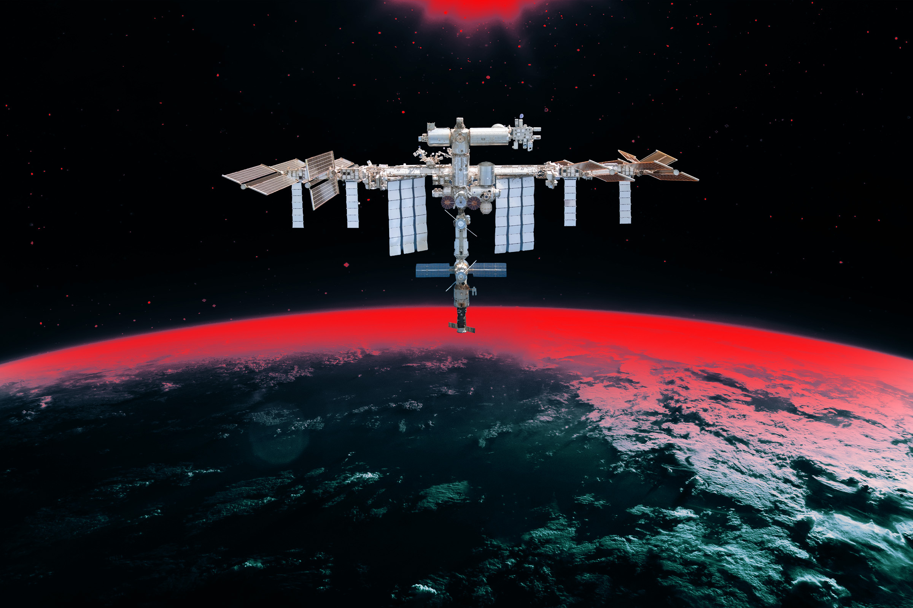

# 俄罗斯要钻墙锯壁修泄漏，NASA紧急下令宇航员避难

> 国际空间站漏气问题持续多年，美俄双方因修复方案爆发严重分歧。6月5日，俄方宇航员拿起锯子走向泄漏舱段，NASA被迫下令5名航天员躲进龙飞船避难。

国际空间站（资料图）

## 七年之痒：老化空间站漏气不断

国际空间站已连续运行超过二十年，设备老化问题日益突出。自2019年以来，连接俄罗斯"星辰号"舱段与对接口的PrK隧道就一直间歇性漏气，令各方担忧不已。

今年6月5日，事态再次升级。NASA新闻秘书贝瑟妮·史蒂文斯在一份通报中证实，5名航天员"出于高度谨慎"已进入停靠的龙飞船避难，原因是俄方正采取"缓解措施"修复裂缝。

## 锯子与电钻：俄方修复方案令NASA胆寒

美俄两国航天机构对当天详情一直保持沉默。但据匿名知情官员向Ars Technica和The Register透露，俄罗斯航天局计划采取极端手段堵漏——这令NASA深感不安。

报道称，俄方最初的方案包括使用手锯，甚至电钻和"钻止器"——一种可在舱壁打穿洞的工具。更严重的是，宇航员曾携带锯子靠近PrK模块，意图锯掉一个承重支架。

"如果他们把那个支架锯掉，后果不堪设想，"一名NASA消息人士告诉Ars。

## 一触即发：NASA用避难行动"表态"

双方沟通彻底破裂后，NASA做出了一个极为罕见的决定：命令Crew-12任务的四名成员，以及去年11月乘坐联盟号抵达的NASA宇航员克里斯·威廉姆斯，全部躲进龙飞船。

"我们威胁说，会让宇航员穿上航天服、进入龙飞船，向全世界传达我们的反对立场，"一名NASA官员说。"但俄方根本不在乎。"

最终，NASA这一决绝的避难行动——让航天员"在飞船里待命"——才让俄方收手。

PrK模块将被退役封存，不再加压。但多年的漏气之争、以及那场险些酿成灾难的对抗，能就此画上句号吗？

"最坏的情况下，你可以把它封死，"欧洲航天局宇航员安德烈亚斯·莫根森早在2024年就曾表示，"空间站还能继续运行。但谁知道还会不会冒出其他问题呢？"

他这句话，像是在幽暗太空中投下的一道影子。

---

## 微信 HTML

```html
<section class="article-content">
...
</section>
```

## 封面图

![[cover.jpg]]
