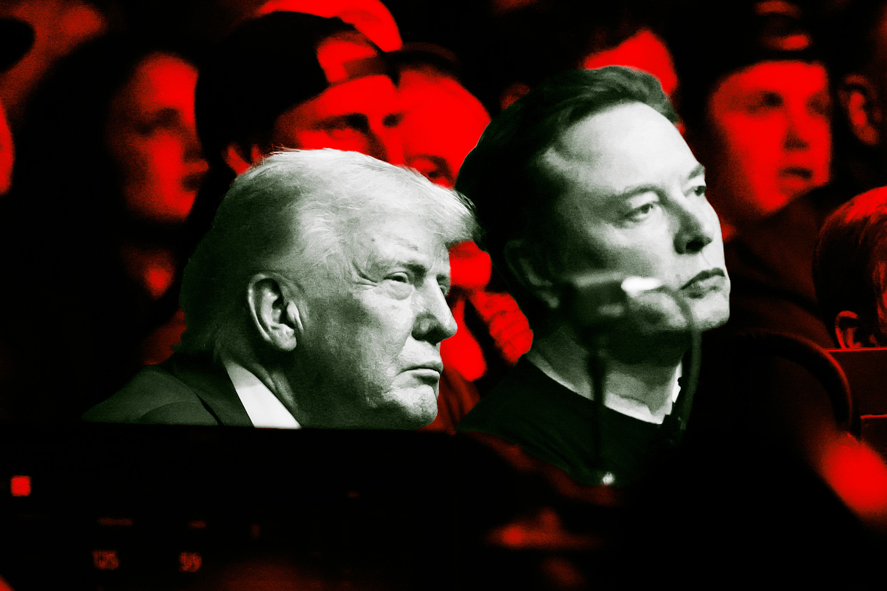

# 马斯克与特朗普政府的利益勾结，正将社会推向危险边缘

> SpaceX上市后面临巨大的盈利压力，而马斯克多年经营的政治关系网——从FCC到五角大楼再到NASA——正在为他扫清一切障碍，代价是监管的失效和公共利益的沦陷。

## 正文

Starlink卫星在轨示意图

上周，SpaceX以一场轰动性的IPO登陆资本市场。但对于这家估值已破万亿的火箭公司来说，真正残酷的考验才刚刚开始——它必须向投资者证明自己有一条可行的盈利路径。

幸运的是，它的CEO埃隆·马斯克早就为自己准备好了"安全网"。

## 一、FCC成"清道夫"，为星链大开绿灯

过去几年，马斯克不遗余力地讨好可能阻碍他的政客，其中最为典型的便是联邦通信委员会（FCC）主席布兰登·卡尔。卡尔的履历上写着明晃晃的一笔：他之所以能坐上这个位置，正是因为毫不掩饰地争取马斯克的好感。

这并非什么私人恩怨，而是关乎真金白银。星链卫星互联网服务是SpaceX当前最重要的收入来源。在卡尔掌舵的FCC与特朗普政府的全力配合下，几乎没有力量能阻止SpaceX向地球轨道发射更多环境破坏性卫星，并霸占越来越多的频谱资源。

TechDirt记者卡尔·博德指出，卡尔领导的FCC几乎是在为一个客户服务——不仅主动放弃监管职责，还出手打击那些控制着SpaceX觊觎的频谱资源的竞争对手。更令人咋舌的是，特朗普政府甚至劫持了2021年的一项基建法案，将原本用于让农村美国人用上平价光纤宽带的那笔钱，改道送进了马斯克的口袋。

## 二、五角大楼和NASA的"撒币"盛宴

马斯克与政府之间的关系远不止FCC。五角大楼向SpaceX授予了数十亿美元的合同，用于开发太空防御技术和军事通信网络。这再次尖锐地揭示了一个事实：这位新晋万亿富翁的商业帝国，极大程度上建立在政府补贴之上。

与此同时，NASA也在特朗普治下与SpaceX深度绑定。一位由马斯克提名的亲密商业伙伴被任命为NASA局长，而SpaceX本身也被内定为美国重返月球计划的关键参与者。

## 三、当权力与资本融为一体

所有这些事实指向一个令人不安的结论：马斯克与特朗普政府之间的利益冲突，已经达到了令人震惊的程度。

监管在萎缩，问责在消失，而财富和权力正以前所未有的速度向地球上最富有的人手中集中。当一艘火箭升空时，我们看到的不仅是科技的未来——还有一个人和一届政府联手编织的权力之网，正在悄悄收紧。

---

![[cover.jpg]]
