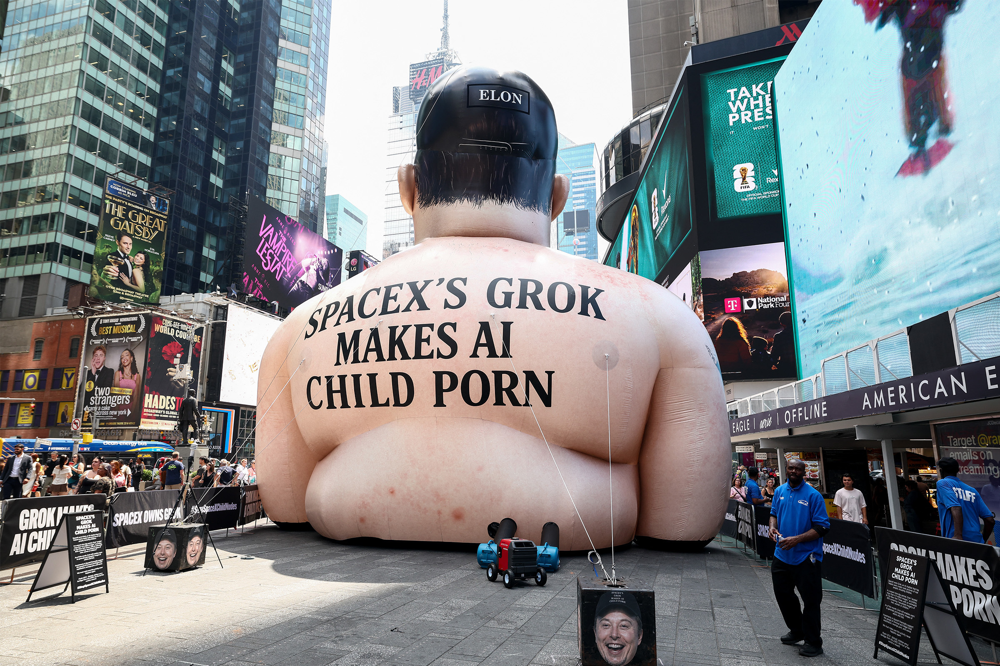

# 刚挤进纳斯达克100，SpaceX 的股价就跌成了"自由落体"

> 入选纳斯达克100本是利好，结果 SpaceX 的股价反而在不到 24 小时内跌到历史新低，连 IPO 开盘价都被击穿。

埃隆·马斯克麾下的 SpaceX，正在经历一场尴尬的开局。

## 利好兑现，股价却跳水

周三，就在公司跻身纳斯达克100指数（由交易所市值最大的 100 家非金融公司组成）还不到 24 小时，股价便遭受重挫。据《华尔街日报》报道，午后股价一度滑落到 145 美元出头的纪录新低——已经跌破了 150 美元的 IPO 开盘价，让本指望"入指"能托起股价的投资者大失所望。

截至发稿，股价虽回弹到 148 美元附近，但过去五个交易日仍跌超 13%，相比 6 月中旬的历史高点更是重挫约 35%。

## 估值与盈利之间的那道鸿沟

疲软的表现，再次把人们拉回那个挥之不去的疑问：这家公司近 2 万亿美元的估值，和它几乎为零的盈利之间，差距实在太大。SpaceX 去年在 185 亿美元营收之下，净亏损近 50 亿美元；而与马斯克 AI 初创公司 xAI 的合并（后者同样在疯狂烧钱），也没能起到什么帮助。

无独有偶，就在同一天，对手 Blue Origin——马斯克死对头贝索斯旗下的公司——宣布以 1300 亿美元估值融资 100 亿美元，首次引入外部资金。两家都在为 NASA 争夺载人重返月球的能力。

SpaceX 这轮下挫，很难说与 Blue Origin 融资直接相关。它更像被整个纳斯达克的不利风潮卷了进去：特朗普政府本周实质性重启了对伊朗的战事，周二财政部又禁止伊朗售油，油价应声跳涨，市场和美国原油期货都被狠狠撞了一下。不过，不少分析师依旧看好 SpaceX——摩根士丹利周二以"增持"评级、300 美元目标价（超现价一倍多）开启覆盖；德银也给出 255 美元目标价，称其在太空部署 AI 基础设施上"优势明显"，尽管这还是一个可能要花多年验证的概念。

---

## 微信 HTML

```html
<section class="article-content">
  <section style="padding: 12px 18px; border-left: 4px solid #DBDBDB; background-color: #f5f5f5; margin-bottom: 24px; border-radius: 2px;">
    <p style="line-height: 1.6; margin: 0; font-size: 15px; color: #888888;">入选纳斯达克100本是利好，结果 SpaceX 的股价反而在不到 24 小时内跌到历史新低，连 IPO 开盘价都被击穿。</p>
  </section>
  <p style="line-height: 3; margin-bottom: 24px;">埃隆·马斯克麾下的 SpaceX，正在经历一场尴尬的开局。</p>
  <p style="line-height: 1.8; margin-bottom: 24px; text-align: center;"><strong><span style="color: #3daad6;">一、利好兑现，股价却跳水</span></strong></p>
  <p style="line-height: 3; margin-bottom: 24px;">周三，就在公司跻身纳斯达克100指数（由交易所市值最大的 100 家非金融公司组成）还不到 24 小时，股价便遭受重挫。据《华尔街日报》报道，午后股价一度滑落到 145 美元出头的纪录新低——已经跌破了 150 美元的 IPO 开盘价，让本指望"入指"能托起股价的投资者大失所望。</p>
  <p style="line-height: 3; margin-bottom: 24px;">截至发稿，股价虽回弹到 148 美元附近，但过去五个交易日仍跌超 13%，相比 6 月中旬的历史高点更是重挫约 35%。</p>
  <p style="line-height: 1.8; margin-bottom: 24px; text-align: center;"><strong><span style="color: #3daad6;">二、估值与盈利之间的那道鸿沟</span></strong></p>
  <p style="line-height: 3; margin-bottom: 24px;">疲软的表现，再次把人们拉回那个挥之不去的疑问：这家公司近 2 万亿美元的估值，和它几乎为零的盈利之间，差距实在太大。SpaceX 去年在 185 亿美元营收之下，净亏损近 50 亿美元；而与马斯克 AI 初创公司 xAI 的合并（后者同样在疯狂烧钱），也没能起到什么帮助。</p>
  <p style="line-height: 3; margin-bottom: 24px;">无独有偶，就在同一天，对手 Blue Origin——马斯克死对头贝索斯旗下的公司——宣布以 1300 亿美元估值融资 100 亿美元，首次引入外部资金。两家都在为 NASA 争夺载人重返月球的能力。</p>
  <p style="line-height: 3; margin-bottom: 24px;">SpaceX 这轮下挫，很难说与 Blue Origin 融资直接相关。它更像被整个纳斯达克的不利风潮卷了进去：特朗普政府本周实质性重启了对伊朗的战事，周二财政部又禁止伊朗售油，油价应声跳涨，市场和美国原油期货都被狠狠撞了一下。不过，不少分析师依旧看好 SpaceX——摩根士丹利周二以"增持"评级、300 美元目标价（超现价一倍多）开启覆盖；德银也给出 255 美元目标价，称其在太空部署 AI 基础设施上"优势明显"，尽管这还是一个可能要花多年验证的概念。</p>
</section>
```

## 封面图

![[cover.jpg]]
