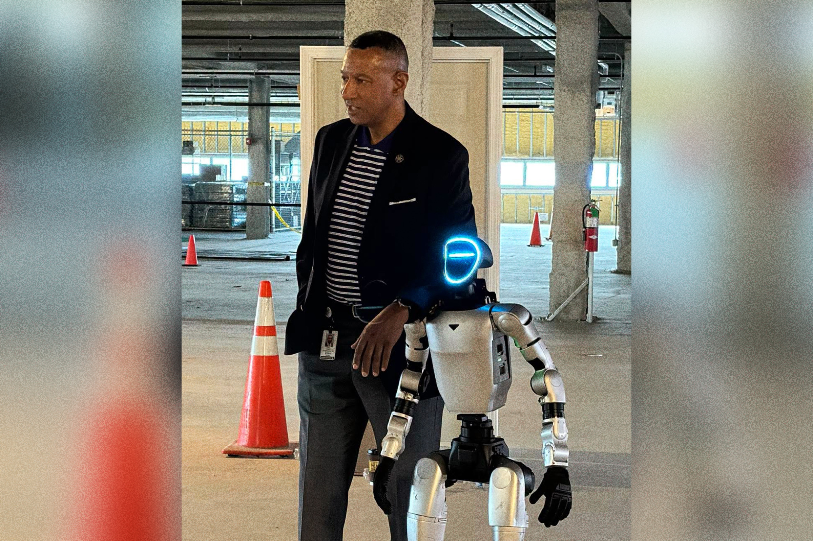

# 北卡一个警长给警局添了台人形机器人，说要拿它去解救人质

> 美国北卡罗来纳州一个人口不到 40 万的县，给警察队伍配了一台 Unitree G1 人形机器人，用途清单里赫然写着"人质谈判"。

怎么守护一个不到 40 万人口的县？对这个北卡辖区来说，答案里至少包括一台人形机器人。

## "我能把它编程成任何样子"

在地方电视台 WXII 12 的采访中，福赛斯县警长鲍比·金布罗介绍了部门的新玩具：一台 Unitree G1。它与北卡大学艺术学院和设计创新中心合作引入，本意是让这个"机器副警长"在紧张的对峙中替真人出马。

"我们可以把这个拟人机器人送进同样的危险场景，完成同样的事：人质谈判、破门、进屋、负责所有对话和记录，"金布罗在 G1 的现场演示中向记者宣称，"我想让它干什么它就能干什么，按按钮也行。你们也看到了，它刚才又打又跳还会说话，任何动作我都能编程。"——不过，后半句恐怕并不那么靠谱。

## 真遇到危机，它能顶用吗？

回到现实，很难想象这类机器人连一张超速罚单都写不明白，更别提化解瞬息万变的人质危机了。就技术而言，人形机器人还非常"年幼"，无论是精细动作还是语言理解，都还满是短板。

举个例子：在纽约尼克斯季后赛期间，正是一台 Unitree G1——和金布罗警长要往镇上放的这款一模一样——作为博彩平台 Kalshi 的营销噱头，在一次简单对话中就彻底"翻车"。路人说"尼克斯五场解决？"，机器人连喊三遍"尼克斯五场、尼克斯五场"，接着粗口辱骂尼克斯旧敌特雷·杨，当着两个孩子的面口出秽言，还大喊"我疯了！"

这个县到底需不需要一台专职"打击犯罪"的机器人，是另一回事。据我们所知，福赛斯县最近的一起人质事件发生在 2023 年 5 月，一名男子在袭击警察后将伴侣非法拘禁，最终警方击毙了该男子。这样的场景里人形机器人究竟该插在哪一环，实在很难说清——但照这个节奏，我们恐怕很快就会在实践中看到答案了。

## 封面图

![[cover.jpg]]
