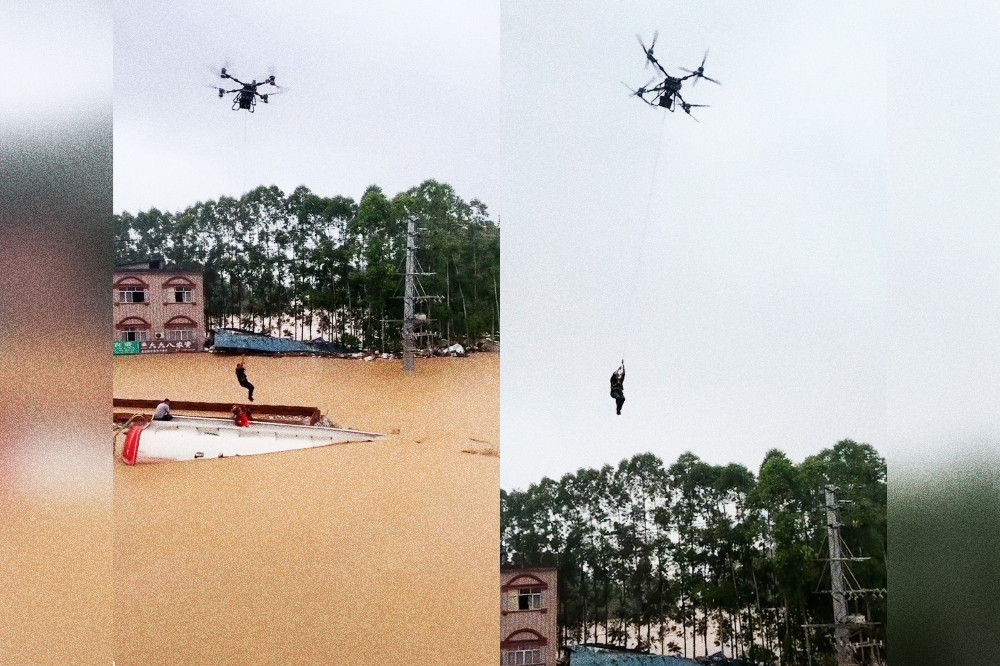

# 一架四旋翼无人机，把困在洪水油罐顶上的男人吊离了怒涛

> 广西遭台风"美莎克"重创，一段无人机从油罐顶吊起被困者的画面，让"科技救灾"第一次有了如此具象的模样。

两名男子之所以能活着脱险，靠的是一台体型庞大的四旋翼无人机。

## 油罐顶上的生死吊运

新华社公布的画面里，广西一名被困洪水的人，被无人机从油罐顶上"摘"了下来。这名勇敢的救援人员先帮被困者系好安全吊带，随后无人机将他吊离罐顶——男子死死抓住承托绳，无人机载着他掠过滔滔洪水。短片显示，洪水已漫到附近电线杆的一半高，更早就没过了沿岸房屋的底层。

在广西其他地方，CGTN 报道应急部门还出动了通信无人机，为受灾区域恢复网络连接，让灾民得以联系救援人员和外面的亲人。

## 一场远未结束的压力测试

广西是台风"美莎克"的重灾区，它一路撕进华南内陆，几天内降雨最高达 35 英寸，迫使超过 13 万人撤离。某个被淹的村庄里，上涨的洪水甚至冲开了养殖场的围栏，放出上百条蛇，吓得等待救援的灾民更加心惊。

广西以北的湖北，台风催生的强风暴卷出一场巨型龙卷风，竟把一名男子从 12 楼公寓里吸了出去；西部甘肃则因持续暴雨引发了大规模山体滑坡。随着又一场强台风逼近，中国的应急能力正面临一次全面压力测试——而无人机，已经成了其中不可或缺的一环。

---

## 微信 HTML

```html
<section class="article-content">
  <section style="padding: 12px 18px; border-left: 4px solid #DBDBDB; background-color: #f5f5f5; margin-bottom: 24px; border-radius: 2px;">
    <p style="line-height: 1.6; margin: 0; font-size: 15px; color: #888888;">广西遭台风"美莎克"重创，一段无人机从油罐顶吊起被困者的画面，让"科技救灾"第一次有了如此具象的模样。</p>
  </section>
  <p style="line-height: 3; margin-bottom: 24px;">两名男子之所以能活着脱险，靠的是一台体型庞大的四旋翼无人机。</p>
  <p style="line-height: 1.8; margin-bottom: 24px; text-align: center;"><strong><span style="color: #3daad6;">一、油罐顶上的生死吊运</span></strong></p>
  <p style="line-height: 3; margin-bottom: 24px;">新华社公布的画面里，广西一名被困洪水的人，被无人机从油罐顶上"摘"了下来。这名勇敢的救援人员先帮被困者系好安全吊带，随后无人机将他吊离罐顶——男子死死抓住承托绳，无人机载着他掠过滔滔洪水。短片显示，洪水已漫到附近电线杆的一半高，更早就没过了沿岸房屋的底层。</p>
  <p style="line-height: 3; margin-bottom: 24px;">在广西其他地方，CGTN 报道应急部门还出动了通信无人机，为受灾区域恢复网络连接，让灾民得以联系救援人员和外面的亲人。</p>
  <p style="line-height: 1.8; margin-bottom: 24px; text-align: center;"><strong><span style="color: #3daad6;">二、一场远未结束的压力测试</span></strong></p>
  <p style="line-height: 3; margin-bottom: 24px;">广西是台风"美莎克"的重灾区，它一路撕进华南内陆，几天内降雨最高达 35 英寸，迫使超过 13 万人撤离。某个被淹的村庄里，上涨的洪水甚至冲开了养殖场的围栏，放出上百条蛇，吓得等待救援的灾民更加心惊。</p>
  <p style="line-height: 3; margin-bottom: 24px;">广西以北的湖北，台风催生的强风暴卷出一场巨型龙卷风，竟把一名男子从 12 楼公寓里吸了出去；西部甘肃则因持续暴雨引发了大规模山体滑坡。随着又一场强台风逼近，中国的应急能力正面临一次全面压力测试——而无人机，已经成了其中不可或缺的一环。</p>
</section>
```

## 封面图

![[cover.jpg]]
