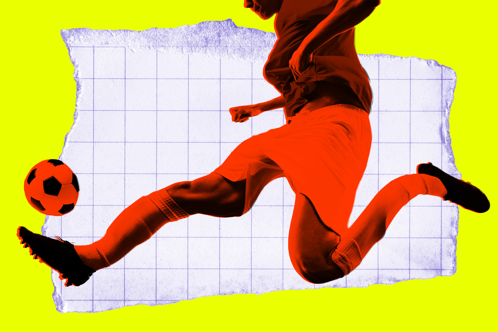

# 比赛还没开打，Coinbase 的 AI 就向全网推送了一条凭空捏造的世界杯捷报

> 加密货币交易平台 Coinbase 发出一条 AI 生成的"突发新闻"，称挪威队已 3 比 2 击败巴西晋级世界杯八强——而当时那场比赛连开场都还没到。

一条本不该存在的"战报"，把 Coinbase 推上了舆论的风口浪尖。

## 一场还没踢完就"赢"了的比赛

挪威队确实最终赢下了巴西，但比分是 2 比 1，而非 Coinbase 那条 AI 推送里信誓旦旦的 3 比 2。更离谱的是，这条"突发新闻"发出时，比赛压根还没开始。考虑到 Coinbase 刚刚与预测市场平台 Kalshi 达成合作，一条凭空捏造的赛果完全可能引发恐慌，让押注的用户凭空亏掉真金白银。

这桩乌龙之所以格外刺眼，是因为这类问题业界已经和它缠斗了太久。从 ChatGPT 这类大模型工具问世起，它们就一直"自信地撒谎、编造假事实"，而这还是在数千亿美元砸进研发之后的结果。

## 这不是第一次，也不会是最后一次

敏锐的网友很快就抓到了 Coinbase 的把柄，直斥这条推送"危险且不负责"。CEO 布莱恩·阿姆斯特朗随后在社交平台回应称"正和团队一起查看"，产品负责人马克斯·布兰茨堡几小时后则声称"已修正错误报道，并做了更新以避免类似不准确"。

可即便颜面扫地，布兰茨堡依然不忘为"AI 全天候交易洞察"的威力沾沾自喜，只是承认"显然"还需要继续调校。他甚至大言不惭地把部分事实揽为己功，说"挪威确实赢了，哈兰德也确实进了 2 球，所以 AI 也许知道点我们不知道的"——考虑到它在开赛前就把结果彻底搞错，这番辩解显得格外滑稽。

Coinbase 远不是最后一家发出错误新闻的平台。最严重的一桩里，苹果曾在去年 1 月被迫撤下一个反复向 iPhone 用户推送假新闻的 AI 功能：它曾谎称被控杀害联合健康 CEO 的路易吉·曼焦内已经开枪自尽，逼得 BBC 正式投诉。而曼焦内至今活着，正等待推迟到 2027 年 1 月的联邦审判。

当预测市场的热度与一本正经的 AI 幻觉叠加在一起，引发的恐怕不只是尴尬，更是一场随时可能失控的混乱。

## 封面图

![[cover.jpg]]
