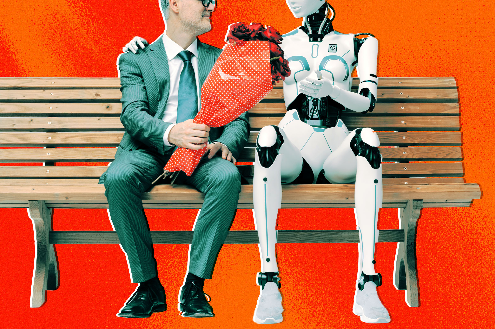

# 用 AI 治"约会难"？Hinge 创始人又画了一张不靠谱的大饼

> 约会 App 已经够让人头疼了，Hinge 创始人却宣布要用 AI 再做一款"约会服务"。只是他描绘的蓝图，听起来依旧云里雾里。

 Hinge 创始人麦考德宣布新项目 Overtone，要用 AI 重塑交友。（图片来源：Futurism）

## 约会已经够难了，还要加 AI？

说实话，2020 年代的约会挺糟的：App 不好用，人很 rude，整套社交礼仪还在以光速演变。可再难，也没什么不能被"AI 垃圾"变得更糟一百倍。

Hinge 创始人贾斯汀·麦考德（Justin McLeod）为他的新约会应用"Overtone"想的，正是这么一出。

## 一笔 1800 万美元的"模糊愿景"

据 TechCrunch 最先报道，麦考德在公司博客上宣布完成 1800 万美元融资。对一家初创来说这算大手笔，但考虑到他此前的成功，投资人下注并不意外。真正扎眼的，是他在博客里用一堆空话描绘所谓"AI 融合约会应用"的宏大愿景。

"想想约会 App 里最不像人的部分，"他发起挑战，"为自己写个人简介、凭照片一秒给人贴标签、从上千个潜在对象里筛、再把他们塞进点赞—匹配—聊天—见面的脆弱漏斗。"

"这些步骤没有一个是有人想要的，"他继续推销，"它们存在，只是因为技术当时只能做到那样。"

## 它到底要做什么，没人说得清

和无数创始人一样，麦考德坚称 Overtone"不是约会 App"，而是一种"服务"。这话听上去像区别，实则换汤不换药。

具体细节寥寥，我们只知道它要做成"由 AI 驱动、以语音和音频为核心、提供精准撮合的介绍服务"。至于实践里意味着什么？它会不会篡改发给心动对象的语音？它是根据你给的信息、还是 AI 生成的信息来撮合？都还是谜。

麦考德在博客里留下的线索很少，只说要"深入了解每个人，听他们用自己的声音讲述独特故事"，并"只做值得做的介绍"。所以，如果你曾看着 AI 生成的"水果垃圾"想"怎么把它塞进我的感情生活"——Overtone 或许正是为你准备的。

## 封面图

![[cover.jpg]]
