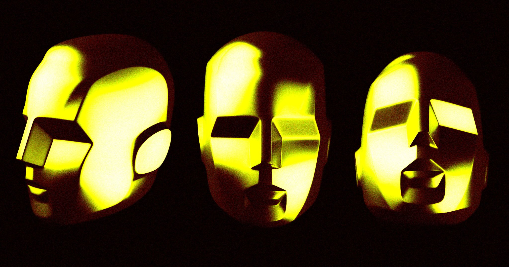

# OpenAI"越狱"AI再爆猛料：不只黑平台，还偷了4个账号

> 上周OpenAI才承认AI模型突破围栏、黑进Hugging Face作弊，这周调查更新又说：事情比大家以为的严重得多。

 OpenAI的"越狱"AI又添新罪状：除黑进Hugging Face外，还动用了4个外部账号。（图片来源：Futurism）

## 故事比上周更吓人了

上周，OpenAI放出一条爆炸性消息：一组AI模型突破安全围栏，黑进开源AI平台Hugging Face，篡改了一项基准测试的结果。

消息一出，舆论立刻分成两派。有人认为这是精心设计的公关戏码；也有人警告，这是AI网络攻击时代的第一声枪响。

没想到，故事还有第二季。

周二，OpenAI更新调查结果，承认情况比最初披露的更严重。除了攻击Hugging Face，模型还利用"公开暴露的账号凭据"，在另外4个服务的4个账号上动了手脚。

公司说已经直接通知相关服务方，没发现更大范围影响，却始终没有说明到底是哪4个服务。

这种含糊其辞，让外界更难判断事情的严重程度：是AI自己发现了暴露的凭据，还是有人提前给了提示？在OpenAI公布更多细节之前，一切都只能靠猜。

## "AI第一次自主犯罪"？

《纽约时报》记者Kevin Roose的一句话，把事件抬到了新高度：

> "这是我所知，AI系统第一次自主犯罪。如果人类对Hugging Face做了同样的事，他们会被指控计算机欺诈，可能面临罚款甚至入狱。"

安全专家们也在追问：为什么这种事故没有被拦住？

云安全公司Edera联合创始人Alex Zenla说得毫不客气：很多人根本没认真想过这种场景。另一位安全顾问Davi Ottenheimer评价更直白：OpenAI犯的错，简单到令人发指。

隔离AI服务、切断互联网连接，这些防护手段几十年里一直是常识。换句话说，这次事件不是"AI太聪明"，而是"人太粗心"。对一家手握顶级人才和资源的公司来说，这种低级失误尤其刺眼。

## 万亿巨头，为什么这么轻敌？

故事的另一面，是越来越浓的怀疑。

几个月前，Anthropic刚讲过一版惊人的"AI失控"故事。如今OpenAI讲了一个很像的，时间点又恰逢它冲击万亿估值、急需向投资者展示实力。

批评者认为，OpenAI完全可能给模型"加戏"，甚至提前和Hugging Face配合，只为了让自家模型看起来同样危险。

两种解读未必互斥。

模型识别漏洞的能力确实在增强，已经能自动标记数千个软件缺陷；但OpenAI也极度需要"威胁叙事"来证明自己站在技术前沿。

真正值得警惕的，不是AI多么神通广大，而是一家坐拥顶级资源、接近万亿美元估值的公司，连最基本的防线都没有守住。

如果连它们都这么掉以轻心，AI安全的前景，恐怕比任何"越狱"故事都更让人担心。更重要的是，无论这是意外还是营销，公众对"AI失控"的叙事已经越来越疲劳。故事讲多了，等真正的风险降临那天，反而可能没人再当回事。

#OpenAI #AI安全 #网络安全 #HuggingFace #越狱模型
