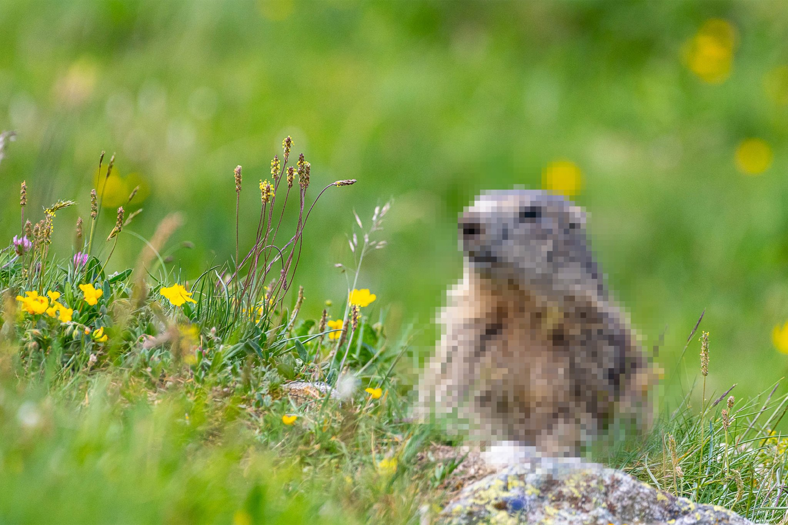

# 科研经费被砍，UCLA科学家被逼上OnlyFans养土拨鼠

> 政府说砍就砍，科学家为了保住几十年研究，只能在OnlyFans上发土拨鼠视频筹钱。这看起来像段子，却是真实发生的事。

 经费断供后，UCLA科学家把土拨鼠搬上了OnlyFans。（图片来源：Futurism）

## 科学家，上了OnlyFans

第一次听说UCLA的生物学家在OnlyFans上开账号，很多人第一反应是：这是什么新型学术黑话？

不是。他们的账号叫OnlyMarms，简介写得很直白：来自落基山脉、不加滤镜的黄腹土拨鼠内容，几乎每天更新。

订阅免费，观众可以自愿打赏，所有钱都用于科研。

在实验室运营这个账号的学生Emily Renkey说，她有时会发自己认为最"萌"的视频，但最喜欢的，是找到一段能用来科普动物行为的录像。

为了让土拨鼠研究继续下去，这个实验室真的把学术内容搬进了成人平台。

有人调侃，这可能是史上"学术含量最高"的OnlyFans账号：观众打赏看的不是别的，而是一群胖乎乎的啮齿动物晒太阳、打架、喊叫。

## 经费是怎么没的？

故事要从2025年说起。

特朗普政府以"效率"为名大规模削减科研经费，马斯克领导的政府效率部在一年内取消了美国国家科学基金（NSF）超过1700项资助，总额约14亿美元。

2026年，NSF发放的经费只是往年约90亿美元的一小部分，白宫还提议把2027财年预算再砍近一半。

更让人心寒的是，很多取消明显带着政治色彩。气候变化研究首当其冲，甚至只是标题里带"climate"的项目都会被针对。法庭文件还承认，部分州的资助被取消，"唯一依据"就是它们在2024年大选中是否支持特朗普。

## 为什么土拨鼠值得研究？

土拨鼠研究为什么也被盯上，谁也说不清。但它绝不是闲得无聊的项目。

Blumstein团队已经追踪这些啮齿动物几十年，这是全球持续时间最长的自由生活哺乳动物研究之一。

Blumstein说，这类长期项目回答的是"我们这个时代最重要的问题之一"，是实时观察演化最宝贵的窗口。

可这样的价值，在算经费的人眼里并不明显。他先后申请续期三次，最后项目官直接放话：永远不会再资助他们，因为"数据太多了"。

事实上，科研界已经不止一次被逼上"花式自救"。经费断供后，有人众筹，有人开源数据，有人把实验室搬进车库。这一次，只是方式更荒诞了一点。

"我甚至不知道该怎么理解这句话，"Blumstein说，"太离谱了。"

## 荒唐自救背后

目前，OnlyMarms只筹到了几百美元，实验室还在四处寻找传统资金。

几百美元对科研来说是杯水车薪，却是一个辛酸信号：当经费分配被政治绑架，科学家只能靠"卖萌"和公众打赏来延续严肃研究。

土拨鼠还在落基山脉的阳光下晒太阳，研究者们却要为一个本该属于科学的未来，陪全世界演一场荒诞剧。

#科研经费 #UCLA #OnlyFans #土拨鼠 #科学
