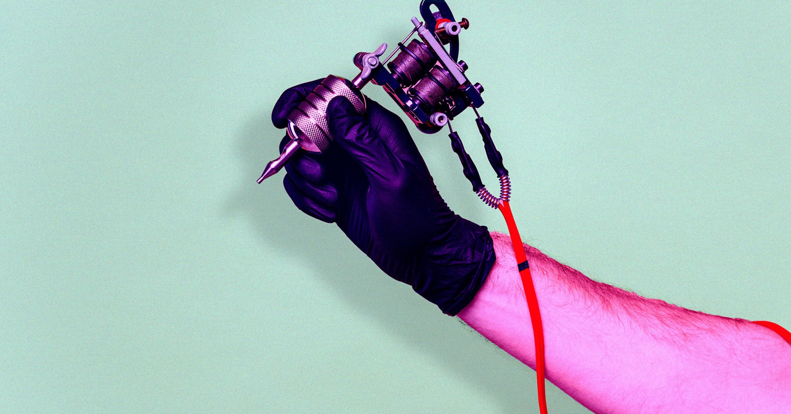

# 为一次面试把公司logo纹在身上？YC系AI创业公司翻车了

> 美国就业市场已经卷到什么程度？一家AI创业公司办招聘派对，把纹身师请到现场：想面试，先把你未来老板的名字刻进皮肤。

 一场以纹身换面试的招聘活动，把就业市场的扭曲放到了聚光灯下。（图片来源：Futurism）

## 离谱招聘：纹logo，换面试

美国现在的就业数据很矛盾：宏观数字说经济不错，失业率还在下降，但普通人找工作的体验却越来越糟糕。

就在这种气氛里，YC孵化的AI创业公司LemonLime，搞了一场让所有人瞪大眼睛的活动。

上周四，这家公司办了一场招聘派对，现场请来真正的纹身师，宣布规则：愿意把LemonLime的logo纹在身上的人，可以直接获得一场"即时面试"。

听起来像恶搞，但联合创始人Jordan Zietz亲自在LinkedIn上炫耀：真有7个人接受了。

他说，这样做的目的是"遇见非凡的人"，顺便筛选出"和我们一样疯狂的人"。

按照他的说法，这既是招聘，也是一场寻找"同类"的狂欢。只是他大概没想到，围观群众并不觉得这很酷，只觉得离谱。

## 现场真的有人纹了

更离谱的是，现场还真有人动了针。

一位参加者Dimple在LinkedIn上澄清：她自己没有纹公司logo，但"几乎其他所有人都纹了LemonLime"。

消息很快传遍社交网络，舆论几乎一边倒：求职者为了一个面试机会，要把雇主的标志永久刻在皮肤上，这到底是招聘还是驯化？

过去也出现过公司要求员工"身体力行"的案例，但通常有丰厚报酬。这次连报酬都没有，只有一张面试入场券。

更糟的是，在求职压力下，所谓"自愿"根本经不起推敲：你不纹，旁边有人纹，主动权就落到了公司手里。更何况，纹身一旦上身，就是一辈子的标记。就算公司日后改名、倒闭，这段求职经历也会一直留在求职者的皮肤上。

## 道歉来得很快

风暴发酵后，Zietz火速道歉，承认自己"搞砸了"。

他在X上写道：虽然参与者是自己选的图案，也没人被强制要求纹logo，但他应该更早意识到，把纹身和招聘挂钩会制造压力和权力不平等。

他还说，相关帖子已经撤下，已经和每位参与者聊过，愿意承担任何人的纹身清除费用。

最后他补了一句：面试本来就对所有人开放。

这句话看似大度，却让整件事更尴尬——既然不需要纹身也能面试，那当初为什么要搞这一出？

## 荒诞背后的真相

这场闹剧真正暴露的，是劳动力市场的严重失衡。

当一家公司可以用"疯狂测试"来挑选员工，而求职者愿意把logo留在身上换一次机会，说明求职者手里的筹码已经少得可怜。

AI行业看起来光鲜，招聘方式却越来越像一场服从性测试。

也许，这就是就业寒冬里最真实的职场景观：公司负责疯狂，求职者负责证明自己"够疯"。而真正需要反思的，或许不只是这家创业公司。

#AI创业 #求职 #YC #纹身 #就业市场
