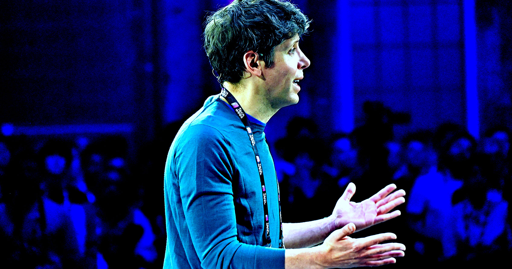

# Sam Altman 建议让 AI 给孩子做"上学播客"，网友炸锅：你为什么不直接跟孩子说话？

> OpenAI 掌门人 Altman 最新育儿建议：把全家日历交给 ChatGPT，每天早上给孩子生成一档播客。动画导演 Alex Hirsch 一句"你为什么不直接跟孩子说话"的反问，点赞量是原推的 20 倍。

 Sam Altman 的 AI 育儿新点子引发群嘲。

## 一条推文，把科技圈的"AI 育儿"推上风口浪尖

去年年底，Altman 上《今夜秀》时就语出惊人，说现在养孩子"不靠 AI 根本不可能"——尽管人类在没有 ChatGPT 的时代也养大了无数代人。

他的发言描绘了一幅相当 dystopian 的画面：人类之间的联结被 AI 保姆和聊天机器人取代。而就在祖父母们忙着给孙辈塞满 AI 生成的劣质绘本、孩子们逐渐丧失阅读能力的当口，Altman 又抛出了他的新点子。

周五，他在推特上写道："昨晚听到一个 ChatGPT 的妙用——把全家日历连起来，让它了解孩子们的喜好。每天早上送孩子上学的路上，让它生成一档播客，聊聊孩子下午的足球赛、某个孩子即将到来的生日、一些新闻……"

提出这个建议的 Altman，去年刚和丈夫通过代孕迎来了自己的孩子。

## "你为什么不直接跟孩子说话？"

给孩子在进学校之前就灌一肚子 AI 生成的废话——这个想法让很多人坐不住了。

动画导演、曾制作《怪诞小镇》的 Alex Hirsch 直接回怼："你为什么不直接跟孩子说话？"这条回复获得的点赞，几乎是 Altman 原推的 20 倍。

脱口秀演员 Gianmarco Soresi 的吐槽更狠："我忍不住一直想这事。不仅因为这主意烂得离谱，更因为这个人正是要跟全美国推销 AI 的人——他对公众利益如此盲目，居然觉得这想法有吸引力。"

演员 Mike Dargatis 也感叹："这些科技大佬跟正常人类行为脱节到了什么地步。"

## 连 OpenAI 自己人都看不下去

Altman 在"如何逃避育儿责任"上不断推出离谱创意的时候，OpenAI 总裁 Greg Brockman 似乎终于意识到：不是 AI 信徒的普通人，可能更珍视人与人之间的联系。

他周六发推说："在 OpenAI，很多人把 ChatGPT 接进了 Slack。但大家真的很讨厌同事的 ChatGPT 来联系自己求助——哪怕同一件事换成同事本人来问，他们完全乐意帮忙。这恰恰说明人有多在乎人际关系、多愿意互相帮助，他们希望 AI 是把时间还给人，或者让相处时间变得更好，而不是成为横在人与人之间的一层隔膜。"

不过 Altman 依然坚信自己站在历史正确的一边。去年上播客时他曾说："我的孩子永远不会比 AI 聪明，但他们会比 AI 能干得多。"他还预言人类会和 AI 建立"很有问题的准社会关系"，逼着社会"想出新的护栏"——甚至承认 ChatGPT"是你不该太信任的技术"，因为它会"产生幻觉"。

一边是让 AI 替自己给孩子做播客的 CEO，一边是"你为什么不直接跟孩子说话"的 20 倍点赞。谁更懂"人"这件事，答案或许已经写在数据里了。
