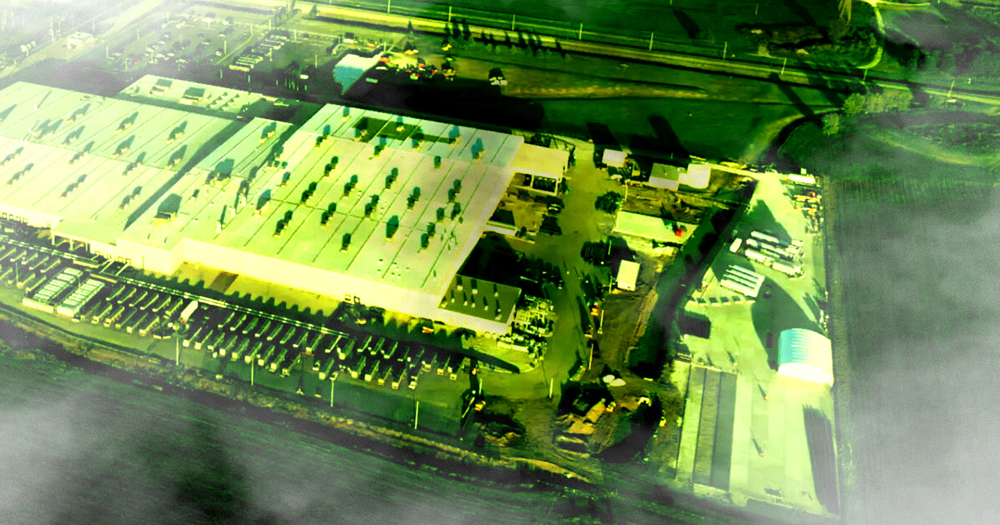

# 被起诉后，SpaceX 说还要再熏周边小镇一年：69台燃气轮机明年才拆

> 马斯克旗下 SpaceX 在孟菲斯附近的无证数据中心被起诉排放污染，公司承诺接入 1.2 吉瓦天然气电厂后拆除 69 台燃气轮机——但时间定在一年后的 2027 年 7 月，这之前周边居民只能继续忍。

 SpaceX 位于孟菲斯附近的数据中心园区，被指长期排放有害废气。

## 挨骂一年，换来的承诺是"再等一年"

在铺天盖地的批评声中，SpaceX 终于表态：将移除为孟菲斯附近巨型数据中心供电的几十台喷烟燃气轮机——这些设备一直是无证运行。但时间点很微妙：一年以后。

据 TechCrunch 报道，SpaceX 在官网更新中公布了计划：把这座全球规模数一数二的 AI 设施，接入一座 1.2 吉瓦的天然气发电厂。公平地说，这比现状要好得多——但需要时间，而在此之前，公司打算继续使用那 69 台运来的便携式燃气轮机，直到 2027 年 7 月才全部拆除。

"我们非常在意做好邻居，也一直在调整电力运营，以降低设施噪音、尽量减少对当地绍斯黑文社区的影响。"公司这样表态。

## 一个"巨像"级数据中心，一群喘不上气的居民

这个名为"巨像"（Colossus）的数据中心园区由两座数据中心组成，早已成为当地居民和环保组织集火的对象。南方环境法律中心代表 NAACP 起诉了 xAI——该公司在并入马斯克的火箭公司并 IPO 后，现已更名为 SpaceXAI——指控其无证运行燃气轮机、排放有害污染物。

诉讼当时估算，这些燃气轮机每年可能排放超过 2000 吨形成雾霾的氮氧化物，还会释放甲醛等危险化学物质。甲醛是已知致癌物，与肺癌和鼻癌有关，还会刺激呼吸道。

今年 5 月，Politico 报道称，这座数据中心已成为该县最大的烟雾生成氮氧化物排放源之一——而该县的雾霾水平，在设施上线之前就已经被认为不健康。

## 孩子们开始咳嗽，黑人社区喘不过气

附近社区的家长们抱怨，设施运行以来，孩子们开始出现呼吸系统问题。以黑人居民为主的 Boxtown 社区，居民们说废气浓到让人呼吸困难。

一边是"我们非常在意做好邻居"的公关话术，一边是 2000 吨氮氧化物、甲醛和孩子们此起彼伏的咳嗽声。SpaceX 承诺的"一年后再拆"，对这家公司是整改计划表，对住在烟囱下的居民，却是又一个 365 天的等待——和每一次深呼吸的赌注。
