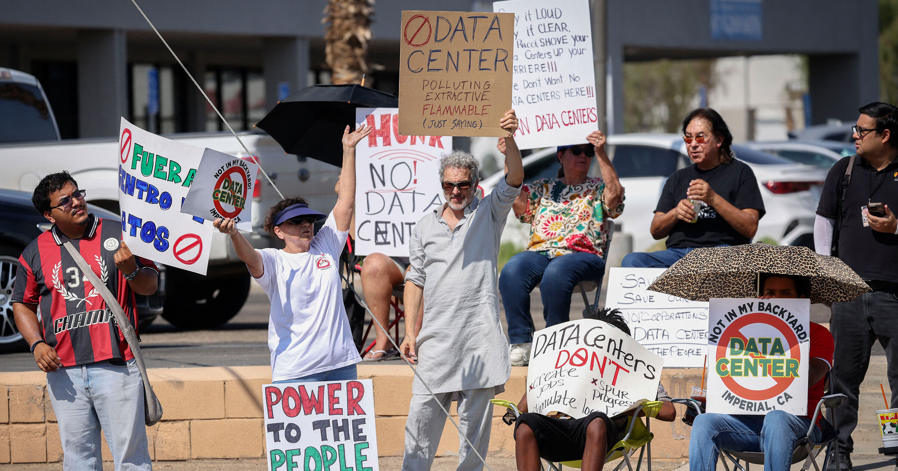

# 今年美国至少37人因抗议数据中心被捕：有人只是鼓了个掌

> 数据中心成了 2026 年美国普通人愿意为此进监狱的少数议题之一。Futurism 统计，今年全美已有至少 37 起因数据中心抗议引发的逮捕，还有人只是鼓掌就被警方带走。

 越来越多普通美国人因反对数据中心建设而被捕。

## 什么议题能让普通人甘愿去坐牢？

能让典型的普通美国人激动到愿意进监狱，可不容易——被捕意味着出庭、罚款，还有可能跟着你一辈子的案底，影响工作和住房。对多数人来说，"坐牢"这个词本身就足以让人安分守己。

但在 2026 年，数据中心成了少数能让越来越多美国人铤而走险的议题。Futurism 统计，今年全美至少有 37 起与数据中心抗议相关的逮捕；另有 12 起警方干预事件，阻止抗议者或发言人与民选官员对峙——而实际数字很可能更高，因为这些案件通常上不了新闻。

和近些年其他政治动荡不同，这些反数据中心抗议者很难被简单归类：有拥有土地的农民，也有物理老师；有年轻人，也有中年人；有小镇居民，也有郊区父母。

尽管背景各异，被捕者们有一个共同点：他们都觉得，民选官员的行为没能反映选民的意愿，反而在向大型科技公司低头。

## 拒绝报名字，就被"请"出了听证会

42 岁的 Pablo Payan 是印第安纳州的一名维修经理。5 月，霍巴特市举行了一场讨论建设亚马逊大型数据中心的公开会议，Payan 发言前拒绝按规矩报上姓名，随即遭到警方驱逐。

就在警察带他离场时，Payan 问了一句为什么，结果直接被以"非法入侵"和"扰乱秩序"为由逮捕。

"在我看来，我被赶出去就是为了证明一点：法律站在他们那边。如果人们继续想表达自己、想发言，就会被执法部门恐吓甚至逮捕。"Payan 事后告诉 Fox32，"我觉得这是在秀肌肉。"

## 鼓掌也是罪？物理老师被当场带走

与执法部门和特朗普政府警告的"反科技极端主义"截然不同，这些抗议绝大多数是和平的，只有在警察动手抓人时才会升级为肢体冲突。许多指控，只是因为抗议者违反了鸡毛蒜皮的会场规则——比如公共发言超时了几秒钟。

堪萨斯州恩波里亚的物理老师 Lux Claridge，就是"借警察之手压制异议"的荒诞典型。本月初的一场公开会议上，Claridge 因为鼓掌支持另一位反对建造千亩数据中心园区的发言者而被逮捕——她违反了专员制定的"禁止打响指和鼓掌"的规定。

"我坚信鼓掌是我受第一修正案保护的权利。"Claridge 事后接受 404 Media 采访时说，"只要我没有干扰会议，我就可以行使这个权利。我仍然坚持认为，我根本没有干扰任何人。"

"我有鼓掌的权利，"她继续说，"如果你们想把我赶出去，那就只能把我拖出去。"

为了一块水泥和服务器组成的园区，农民放下农活，老师举起双手，普通人把自己送进警局。当表达反对的成本变成手铐，而鼓掌都成了"罪行"，数据中心建得再快，也填不平民主的裂缝。
