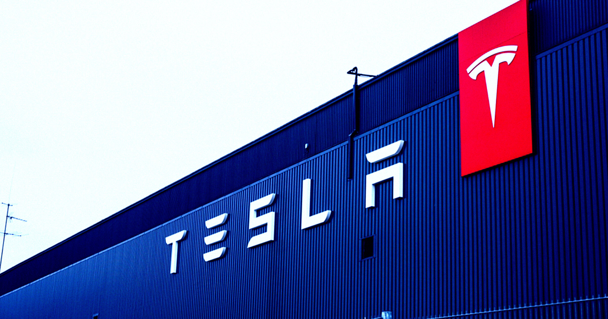

# 特斯拉前经理爆猛料：一个人管38辆自动驾驶测试车，累到"睡着了还在接事故电话"

> 休斯顿 FSD 测试车队前经理 Javier Medrano 起诉特斯拉：车队两年内从 15 人扩到 38 人，却只给他一个远程主管，连睡觉时都被迫接事故电话。他向公司求救的信号，换来的回复是"把手机调成勿扰模式"。

 特斯拉自动驾驶测试车队的前经理指控公司把人逼到极限。

## 一个人管 38 辆车的"滚动炸弹"

多年来，特斯拉一直因为自动驾驶软件的安全性承受着公众和监管的双重压力。现在，一位前经理站了出来，把矛头对准了马斯克治下这家车企"危险"的测试方式。

据《独立报》报道，前经理 Javier Medrano 在联邦诉讼中指控：特斯拉把休斯顿的自动驾驶测试车队变成了全天候的"滚动隐患"——车队规模疯狂扩张，翻了一倍多，多到他一个人根本管不过来。

Medrano 说，他不停向高层要人，但警告全被无视，最后他自己被炒了鱿鱼。

"你几乎觉得这些大公司可以为所欲为，大家只能低头认命，说'好吧，就是这样'。"他对《独立报》说，"这种环境会让人不敢说'这样不对'。"

## 38:1 的配比，远超公司自己的安全底线

Medrano 2023 年入职，八个月后成为休斯顿 FSD 测试车队唯一的管理者。他接手时，车队加操作员一共 15 人；几个月后，特斯拉把规模扩到 38 名车辆操作员。这些人三班倒，让车辆 24 小时不停运转，而远程管理的，只有 Medrano 一个。

诉讼指出，这个"危险的 38:1 操作员与主管配比"，违反了特斯拉自己规定的"15:1 安全基线"。

这些操作员属于特斯拉臭名昭著的"牛仔队"（Rodeo Team）——这个称呼很贴切：他们故意让自动驾驶车陷入危险境地，直到最后一刻才人工介入，为特斯拉提供宝贵的训练数据。诉讼称，其他城市的牛仔队都有不止一个安全负责人。

独自管理这支"自驾特技队"把 Medrano 折磨得精疲力竭。他在一封给老板的邮件里坦白："我正努力不让自己彻底崩溃——睡不好、吃不好，还要做一切该做的事来达到预期。"一个月后，他再次恳求增加安全负责人，并请假一周。"这是我正式的求救信号。"他写道。

## "睡着接电话"之后，HR 让他开勿扰模式

所有的预警最终爆发了。发出那条消息几天后，一辆 FSD 测试车与另一辆车相撞。凌晨 2:05，测试驾驶员按流程给 Medrano 打了电话。

但 Medrano 太累了，据诉状描述，他接电话时"人还在生理性睡眠状态"，结果给了操作员错误的指导。操作员听从他的指令留在事故现场，随后被一个神志不清的陌生人接近。

第二天 Medrano 告诉 HR，他对那通电话"毫无记忆"，并再次强调"严重人手不足"。而他得到的回应，令人匪夷所思：HR 建议他如果不想在测试期间被打扰，就把手机设成"勿扰模式"；Autopilot 部门主管则说，他应该"更好地授权"。

"但我没有人可以授权。"Medrano 对《独立报》说，"我真的很想让他们知道这事有多严重，但他们完全没有紧迫感。其他城市每个班次都有多个负责人，只有我没有这种待遇。我们的工作，是确保这些车在路上是安全的。"

一个人、38 辆车、24 小时、三班倒。特斯拉一边高调宣传"全自动驾驶"，一边把安全底线交给一个累到在睡梦中接电话的人——直到出事的这一刻，才终于有人听见了那个 S.O.S。
