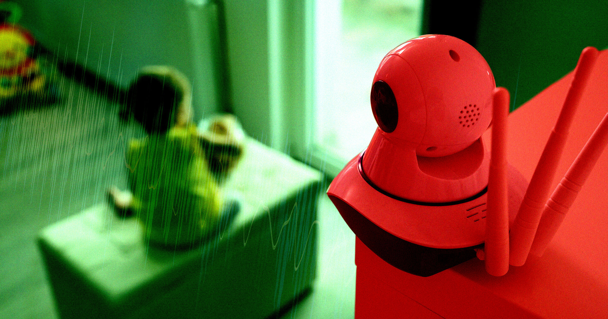

# AI公司CEO偷偷录下幼儿对话喂给AI，还建了个网站炫耀

> AI公司CEO在幼儿过夜时偷装麦克风录音，用AI把对话剪辑成片段、建了网站展示，引发网友愤怒。

偷听孩子的"婴儿语"，然后用AI把它们变成网页展品——这位科技CEO觉得这是天才操作

一位AI创业公司的CEO最近在网上炫耀了一件事：他把两个幼儿的夜间对话偷偷录了下来，喂给AI处理，还给全家人做了一个"语音精选网站"。

Nicholas Charriere是AI建站工具Mocha的CEO。上周五他在X上发帖说，自己的孩子要和表弟第一次一起过夜了——这是个"非常有纪念意义的经历"。于是他做了一个决定：在两个孩子的房间里偷偷放了个麦克风，录下他们所有的对话。

然后，他把录音全部喂给了Claude模型。

## 把孩子的童言童语变成AI展品

Charriere说，他用AI"为全家人建了一个私人网页，音频被切成了一个个片段，全都命名好了、剪辑好了。"他在帖子里附了一张截图——网站上列着一堆精选"曲目"，比如"嗨妈妈""我是大男孩""我放了个屁"。

"全家人都开心极了，"他写道，"AI真是太棒了。"

但很多人觉得这根本不是什么值得开心的事。

## 你说这是"纯快乐"，孩子可不一定这么想

网友们的反应几乎一边倒地愤怒。一条高赞回复写道："如果我爸妈做过这种事，我肯定会恨死他们。完全不尊重隐私。他们是人，不是专门用来逗你开心的迷你玩具。"

历史播客主持人Mike Duncan更加犀利："你为什么不保留深夜sleepover聊天的纯粹和隐私，而非要把一切都偷偷录下来，喂给AI垃圾制造机，再发到网上炫耀？"

事实上，这不是孤例。OpenAI的CEO Sam Altman最近也透露，他大量依赖ChatGPT照顾孩子，甚至想过用AI在孩子上学路上生成他们喜欢的话题播客。Meta则正在开发一款用AI给孩子讲临时编的睡前故事的应用。有记者问Altman："为什么不直接跟孩子说话？"这条回怼在网上传疯了。

AI怀疑论者指出，这些做法本质上是用技术偷懒，替代人与人之间的互动。更关键的问题是隐私——AI公司并不总是透明地告诉你，你喂进去的对话会被用来做什么，它们很可能会被拿去训练下一代模型。

## 孩子还小，但信任不会永远在原地等你

偷听两个还不懂事的孩子、把他们的童言童语塞进AI——说实话，可能也没什么太严重的隐私后果。但建个网站来展示这些内容，还到处炫耀，就让人觉得不对劲了。

更值得想一想的是：当这些孩子长大后发现，他们说过的话从未被当作隐私来对待，甚至被做成了AI展品发到网上——那时候，他们还会觉得"纯粹的快乐"吗？

父母和AI的交汇点注定是个充满争议的地带。技术在变，但有些东西不应该变——比如，孩子说话时那点小小的信任。
