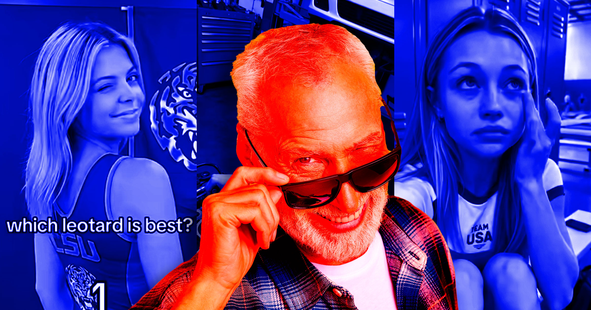

# Facebook 上的大爷们对着 AI 生成的虚拟美女疯狂表白，完全没意识到一切都是假的

> AI 生成的虚拟网红在 Facebook 上大量涌现，大批中老年男性用户深信不疑地留言互动，折射出社交时代的孤独困局。

AI 生成的虚拟美女视频正在 Facebook 上收割中老年用户的热情与真心

## 从图片到视频，AI 虚拟网红全面升级

早在 2023 年，AI 生成的虚拟网红就在 Instagram 上每条帖子能收获数千次互动。几年过去，这些套路不仅没消退，反而更加精细。如今 Meta 的平台上充斥着大量 AI 生成的年轻女性视频——她们摆出挑逗的姿态，游走在平台色情内容规则的边缘，把擦边球打到了极致。

按理说，经过这么多年的 AI 生成内容讨论，用户多少该有些警觉了。但现实恰恰相反，这些视频反而吸引了大批孤独的中老年男性，他们完全不知道屏幕里的人根本不存在。

## 评论区里的真情告白，全给了空气

一个名叫"Grace the gymnast"的 AI 账号发布了一条视频，视频里的虚拟形象娇羞地问她的 6600 名粉丝："哪件体操服最好看？"评论区立刻炸开了锅。一位 Facebook 用户留言说："她们全应该躺在地上才好看！"

另一个名叫"Kylie Blaze"的虚拟网红在修车视频里说道："我有个会夹的 taco，但老男人们大概会直接划过我，毕竟我只是个年轻的女修理工。"这条明显是精心设计的诱饵视频，竟然吸引了近千条评论。

"我可不会划过你，"一位看起来上了年纪的 Facebook 用户写道，"我喜欢会夹的 taco。"另一位留言的用户，头像显示是位中年男性，自称"老修理工"，表示"很乐意尝尝那个油腻的 taco"。点进他的主页，会发现他关注了几十个类似的虚拟网红账号。

还有一个名叫"Issy Dexan"的账号更加狡猾，它用的策略是假装自己没人关注。视频里的虚拟形象楚楚可怜地说："我知道我只是个又蠢又矮的体操小妹，但你还是愿意给我点个赞吗？"结果超过 100 名男性争相留言表白。有人写道："你一点都不蠢！如果你需要人抱抱你，我可以帮忙。"

## 当虚拟人设遇上真实孤独

这些虚拟网红账号赤裸裸地揭示了生成式 AI 时代社交媒体的荒诞现状。得益于日益易用的视频生成工具，Facebook 和 Instagram 正被大量粗制滥造的虚拟内容淹没——而这些内容的设计目的，就是精准击中人类最原始的本能。

更令人忧虑的是，有相当一部分用户似乎完全没有意识到这一切都是假的。这不是什么新鲜事，早在几年前我们就已经见识过了。

而这些用户对虚拟人设的狂热追捧，还揭示了一个更深层的问题：席卷全球的孤独流行病。研究表明，社交平台的使用与孤独感之间存在密切关联。像 Facebook 和 Instagram 这样的应用，非但没有促进人与人之间的真实连接，反而让人们越来越孤独。屏幕那头是一个根本不存在的人，屏幕这头却是一个渴望被回应的真实灵魂——这或许是我们这个时代最令人心酸的画面。
