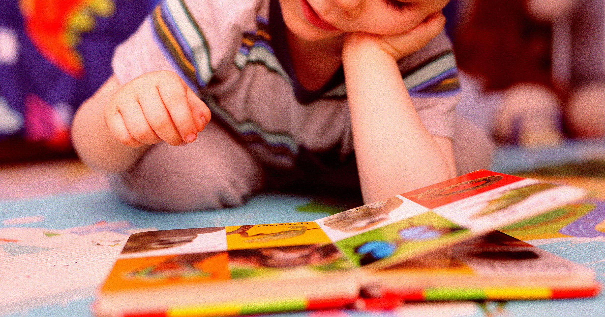

# 爷爷奶奶用 AI 给孙辈做了本"专属绘本"，年轻父母看完血压直接拉满

> 美国的爷爷奶奶们正流行用 AI 给孙子孙女定制绘本——主角是自家孩子，名字、长相、生活细节全都"贴脸"。按说是一片好心，可年轻父母们不但不领情，还炸了：孩子的照片被喂给 AI、个人信息被写进书里，这事儿经过谁同意了？

## 正文

AI 生成的儿童定制绘本正成为祖辈送孙辈的新"流行"。

连最珍贵的亲子共读时光，都没能逃过 AI 的"魔爪"。

据《连线》杂志报道，全美各地的年轻父母正被孩子祖辈送的"AI 绘本"搞得哭笑不得——甚至引发家庭矛盾。

## 一本"专属绘本"是怎么惹怒父母的？

祖辈们的初衷其实很简单：觉得用 AI 给孩子做一本"专属绘本"很可爱，主角就是自家孙子孙女。

但在年轻父母眼里，这事儿完全不是那么回事。一位母亲在 Reddit 上发帖，气得不行：她反复跟自己的母亲强调过，不支持 AI 生成的艺术，坚决反对把孩子的照片喂给 AI、或者在任何环节使用家人的身份信息。

结果呢？老人家照样用 AI 生成了以孩子为主角的故事——角色长相按孩子来设计，情节取材自和孩子相处的真实经历，连一家人名字都直接用上了，理由是"让孩子在书里看到自己的家人"。

这位母亲的愤怒点在于：孩子从小就被"喂"给了 AI，照片和隐私信息流向了一个完全不受控制的系统。

## 孩子自己爱看吗？

答案可能让祖辈们有点扎心：孩子们也不买账。

一位爸爸告诉《连线》，他家 7 岁和 3 岁的两个孩子，对亲戚送的"个性化"AI 绘本的反应就一个字——"无聊"。

"这些书又长又啰嗦，每本读完一遍，孩子们就说：'行吧，我们还是读《小蓝卡车》吧。'"——他说的是畅销儿童绘本作家 Alice Schertle 的经典系列。

麦考瑞大学研究员 Daozhi Xu 专门分析过"AI 儿童绘本热潮"，对这个结果毫不意外："孩子喜欢一本故事书，不是因为书里出现了自己的名字或照片，而是因为故事本身有意思。相比之下，AI 生成的书往往缺乏幽默感、缺少让人记住的角色，也没有戏剧张力。"

## 最让人不安的问题：孩子的照片去哪了？

除了质量堪忧，这件事还有更阴暗的一面。

Xu 指出，最值得警惕的是透明度问题：孩子的照片在 AI 平台上如何使用、如何存储，外界一无所知，"它们可能被分享给第三方，甚至被用来训练 AI 模型"。

现在，市面上已经冒出一整条产业链——Imagitime、StoryWonderBook、Childbook.ai 等一堆服务，都在提供"把孩子塞进 AI 故事"的便捷入口。

一位喜剧演员吐槽，自己父母送了一本 AI 绘本，主题是老人家平时带两个外孙女玩的那些事。他说："长辈们是好心，但真的让人无语。"——孩子们的反应也很平淡，远没有看其他书时那股兴奋劲。

AI 能生成的故事越来越多，可有些东西，机器确实替代不了：比如一个真正为孩子写的故事，那种有人味儿、有温度的创作。
