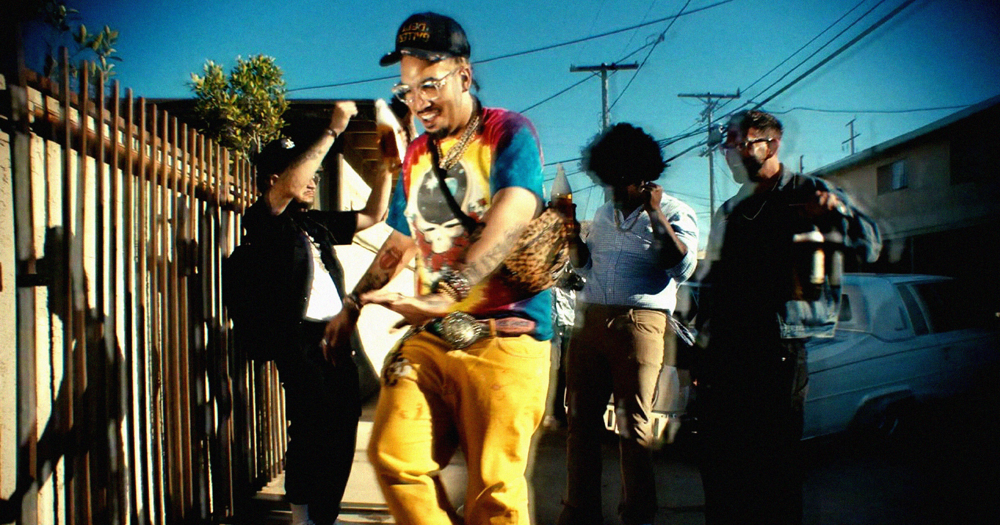

# 说唱歌手死不承认，但这首冲上Billboard的热单怎么看都像AI写的

> 一首歌引发的AI造假疑云，证据越来越多，歌手却越描越黑

当AI音乐遇上Billboard榜单

## 一首听起来「不对劲」的热单

洛杉矶说唱歌手Fenix Flexin的新单曲《Rubberz》今年六月发布后一路冲上Billboard Hot 100第58位，圈内不少同行纷纷点赞。然而听众们很快就察觉到了不对劲。

首先是人声——听起来完全不像Fenix本人，不仅音色差异明显，还出现了他职业生涯中从未展示过的高音。更尴尬的是他的"现场"表演，口型都对不上，歌词似乎都记不全，而且歌词本身也近乎不知所云。更离谱的是，这首歌里他居然操着一口英国口音，风格是他从未尝试过的80年代合成器流行——这和他一贯的说唱路线毫无关系。

## 那个文件名暴露了一切

音乐制作人Medasin上周发布了一篇详细分析，逐一列举了这首歌疑似AI生成的证据。其中最尴尬的一个细节是：Fenix曾上传过一段未完成版本的片段，而文件名赫然包含"Sonauto"字样——这正是一款AI音乐生成工具的名字，而且这款工具恰好在歌曲发布前两天更名为Treblo。

《The Verge》的分析也指出了大量异常：踩镲音色带有明显的"脆裂感"，副歌人声听起来像低比特率MP3，混响尾音被随意截断。词曲作者Charlie Harding更是直言，这些问题根源在于AI模型普遍使用低质量的未授权MP3训练，导致生成的器乐带有明显的劣化痕迹。

## 自证清白反而越描越黑

面对铺天盖地的质疑，Fenix发布了一段自己在Pro Tools中展示工程文件的视频，声称这证明歌曲是亲手制作的。但Medasin等人并不买账——他完全可以把AI生成的歌曲丢进音轨分离器，再把分离出的音轨铺进工程文件，看起来就像原始录音。更耐人寻味的是，Fenix随后删除了这段视频。

归根结底，没有人能拿出铁证一锤定音。但考虑到这首歌本身的质量实在令人堪忧，也许对Fenix来说，承认是AI作品反而能让他在艺术声誉上稍微体面一些。
