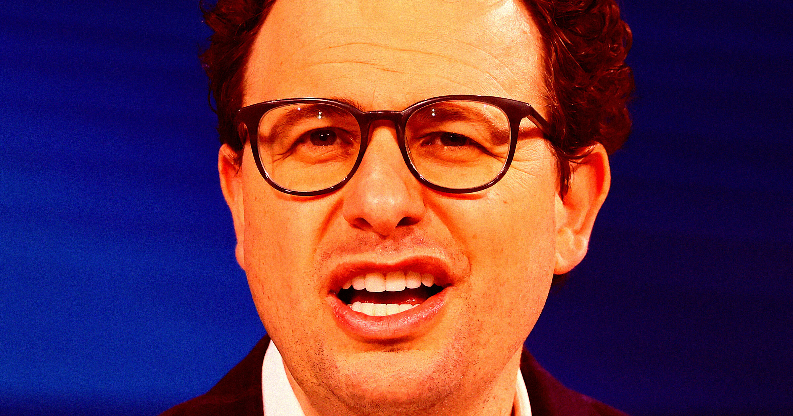

# 全球最贵 AI 公司老板抱怨：新招的员工都不是为了理想，就是为了钱

> 估值 9650 亿美元的 Anthropic 掌门人 Dario Amodei 最近很苦恼。据 Axios 援引知情人士消息，他觉得公司新招进来的人"动机不纯"——不是冲着公司的伟大使命来的，而是冲着高薪来的。给着全行业最好的薪水，转头又嫌弃员工太看重钱，这家"安全第一"的 AI 公司最近的操作有点自相矛盾。

## 正文

Anthropic CEO Dario Amodei 担心新员工是为了高薪而非公司使命加入。

消息一出，网友的反应出奇一致：这难道不是意料之中吗？

Anthropic 开的是全行业数一数二的薪水，如今却担心自己"被成功反噬"。作为全世界估值最高的 AI 公司，这烦恼听起来确实有点凡尔赛。

## "安全第一"的人设，还立得住吗？

更讽刺的是这句话出自 Amodei 之口。

Anthropic 对外宣称的使命，是安全地构建先进的 AI 系统。当年他从 OpenAI 出走创业，一部分原因就是不满老东家跟微软合作、变得越来越商业化。

可现在呢？Anthropic 正在筹备一场万众期待的万亿美元级 IPO。一旦上市，公司能融到天文数字的资金——代价是那句"崇高道德使命"，从此得听命于华尔街的逐利逻辑。

这已经不是公司第一次被人质疑"人设崩塌"了。今年早些时候，它放弃了一项关键安全承诺——原来说好如果无法保证 AI 模型有适当护栏就停止训练，现在不认了。嘴上说着跟五角大楼在 AI 安全部署上有分歧，背地里却让军方用 Claude 模型在伊朗选择打击目标。

暗地里，它还被曝出在帮美国国家安全局用其 Mythos 模型（Anthropic 自己强调过极其危险）对中国发动网络战。最近又被抓到用隐藏代码偷偷监控中国用户。

## 谁有资格说员工"不够高尚"？

别忘了 Amodei 自己还预言过：未来几年，AI 会干掉一半初级办公室岗位。

如果他说的没错，那这些新员工的选择反而很好理解——趁自己的饭碗还在，先上这艘稳赢的船、把钱拿到手再说。

毕竟，在一家一边喊着"安全第一"、一边疯狂追求估值的公司里，要求员工只谈理想不谈钱，多少有点强人所难。
