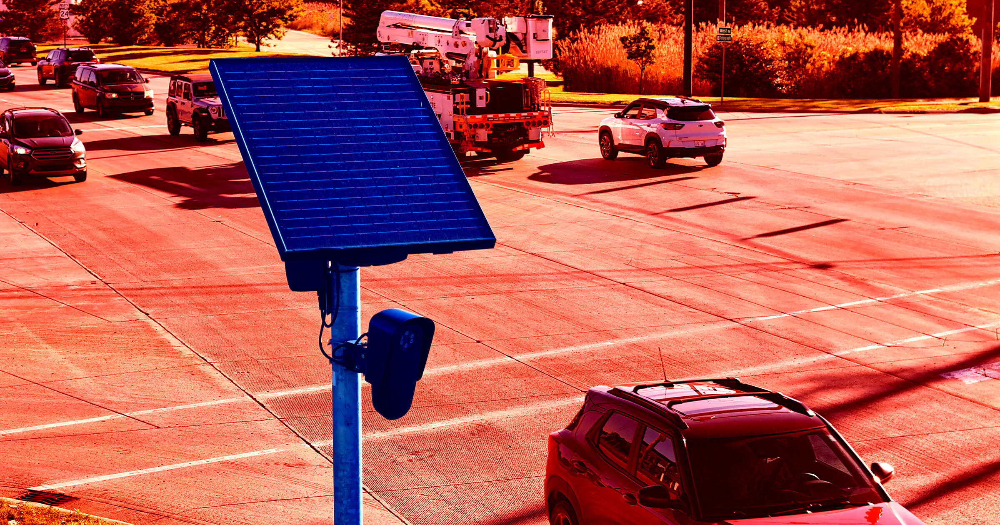

# 谷歌 AI 一本正经地告诉网友：路边车牌摄像头里全是黄金和铜，拆了能卖钱

> 网上一直流传一个段子：Flock 公司的 AI 车牌识别摄像头里藏着黄金、铜、锌等值钱金属，拆一台就能去废品站换钱。以前这只是段子，现在谷歌的 AI 搜索摘要居然当真了——还给出了精确的数字：一台摄像头含 1 到 5 克黄金，市值最高 650 美元。

## 正文

谷歌 AI 搜索摘要声称，Flock 车牌识别摄像头内含有 1 到 5 克黄金，价值最高可达 650 美元。

这个说法有多离谱？谷歌还声称每台摄像头里有两到 23 磅的铜——可这台设备整机才重 3 磅。一台机器里的铜比整台机器还重，这已经不是"误差"，而是纯粹在编故事了。

## 一个段子是怎么变成"AI 事实"的？

事情的起点是个网络梗。

Flock 的 AI 车牌识别摄像头（ALPR）在网络上名声很差，注重隐私的网友社区里流传着各种嘲讽它、甚至鼓励砸毁它的段子和视频。其中流传最广的一个说法是：这些摄像头里塞满了黄金、铜、锌等值钱金属，不如撬开一台去废品站卖了。

这个梗当然是玩笑——摄像头里确实含微量黄金和其他金属，但少到根本不值得拆。懂行的人都知道，靠拆电路板攒的那点钱，连个汉堡都买不起，更别说回本了。

结果谷歌的 AI 摘要完美错过了这个玩笑。

在谷歌搜索"一台 Flock 摄像头有多少黄金"，AI 摘要不但没有反驳，反而一本正经地给出答案："一台 Flock 安全摄像头内部电路板和线缆中约含 1 到 5 克黄金。"按当前金价算，这意味着每台摄像头里有高达 650 美元的黄金。

## 谷歌的"依据"是什么？

谷歌 AI 摘要为这个说法列出了两个来源，结果一个都站不住脚。

第一个来源是一篇匿名的 Substack 帖子，账号名叫"不要服从、不要配合"，声称"每台摄像头金属的粗略废品回收价值估计在 150 到 500 美元"。但谷歌摘要悄悄省略了关键细节——这个数字来自"基于废品价值讨论的估算"。说白了，就是网友拍脑袋。

第二个来源更离谱：一条 AI 生成的 Instagram 帖子，内容就是玩这个梗，怂恿大家拆开摄像头取"珍贵的内脏"。而发帖账号看起来是个大麻种植户，其他帖子全在讲植物克隆、水培和成熟的大麻花。

一个搞 AI 监控的公司，用自己家的搜索引擎，给另一个搞 AI 监控公司的产品"制造"了被砸的理由。这件事本身就足以概括如今整个沉迷 AI 的科技行业有多荒诞。

截至目前，谷歌没有回应置评请求。
