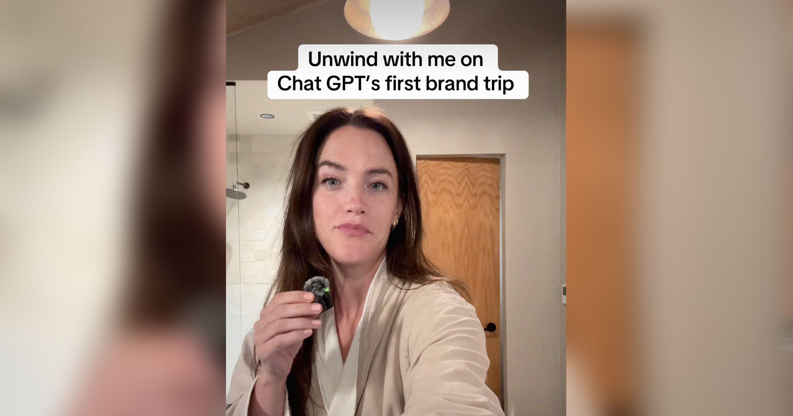

# 她爆了！网红怒斥大家不喜欢她为OpenAI打广告？

> 一篇关于网红对付费宣传的不满文章

一篇关于网红对付费宣传的不满文章

## 网红为何生气？

网红最近在社交媒体上爆发，痛批粉丝们不理解她的付出——作为OpenAI的一名付费代言
人，她认为理应得到支持。

## 人们为什么反对？

原来，很多网友觉得她在为一家技术公司做广告，反而损害了她个人的品牌和形象。这
让网红感到非常困扰，她解释说这其实是为了推广新技术，帮助更多人了解AI的力量。

## 网红的未来

面对众多批评，网红虽然情绪激动，但依然坚持认为自己的决定是正确的，并期待通过
更多努力赢得大家的理解与支持。这次风波似乎让她更加坚定地站在了科技宣传的第一
线。

