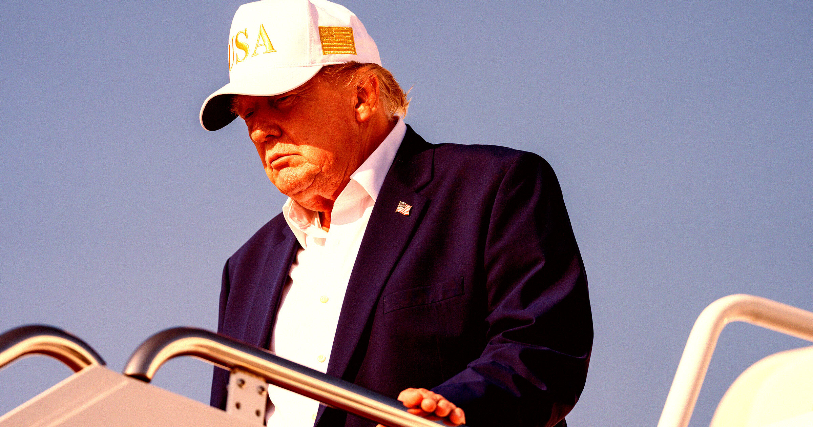

# 心脏问题频发？特朗普是否真的健康堪忧？

> 特朗普的心脏医生说，他出现了非常令人担忧的迹象。

特朗普的心脏医生说，他出现了非常令人担忧的迹象。

## 医生警告

心脏科专家Dick Cheney的主治医师发出警告，称唐纳德·特朗普近期身体状况引发了极
大的忧虑。这些信号是否预示着更严重的问题呢？

## 重要迹象

据透露，特朗普最近的一些行为和表现引起了医生的高度警惕。他经常表现出疲劳、气
短等症状，这背后的原因可能远不止那么简单。

## 健康警钟

面对这样的警告，我们不禁要问：美国前总统的健康状况真的令人放心吗？希望时间能
给出答案，并祝愿他早日康复！

