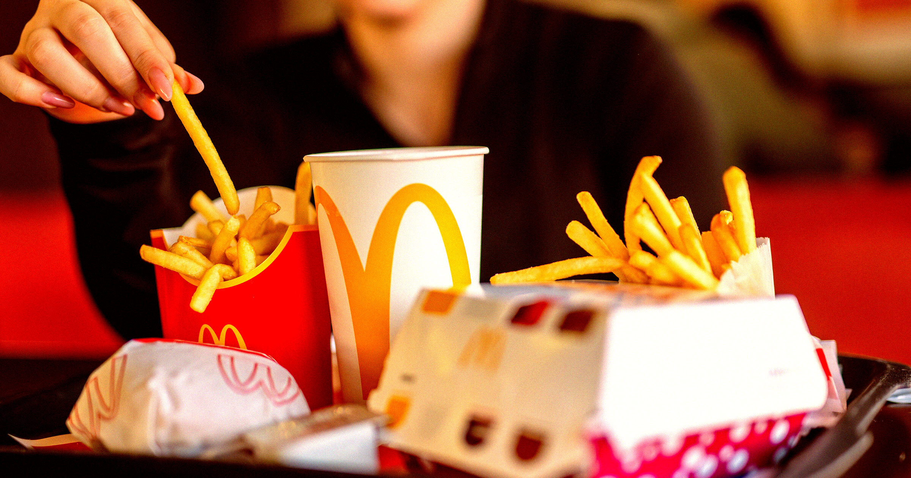

# 麦当劳竟然掌握了几百页关于你的秘密，你也可以拥有！

> 了解麦当劳对你了如指掌的秘密资料吧！

了解麦当劳对你了如指掌的秘密资料吧！

## 这是你的“顾客档案”吗？

麦当劳竟然为你建立了数百页的详细资料！这些信息涵盖了你的点餐偏好、常去店址甚
至是消费频率。这不仅让他们能够提供更加个性化的服务，还能让你感受到被重视。

## 你也能拥有这一份专属报告

更令人惊讶的是，这项权利其实属于你。麦当劳允许顾客申请一份自己的“客户档案”副
本。通过这种方式，你可以更好地了解自己在这家全球连锁快餐品牌眼中的形象和喜好
。

## 深入了解，不再只是简单的快餐体验！

当你真正理解了这些数据背后的故事时，每次走进麦当劳都将是一次不同以往的体验。
这份专属报告不仅是一份回顾过去的资料，更像是一种对未来的指引——让未来更加符合
你的期待。

