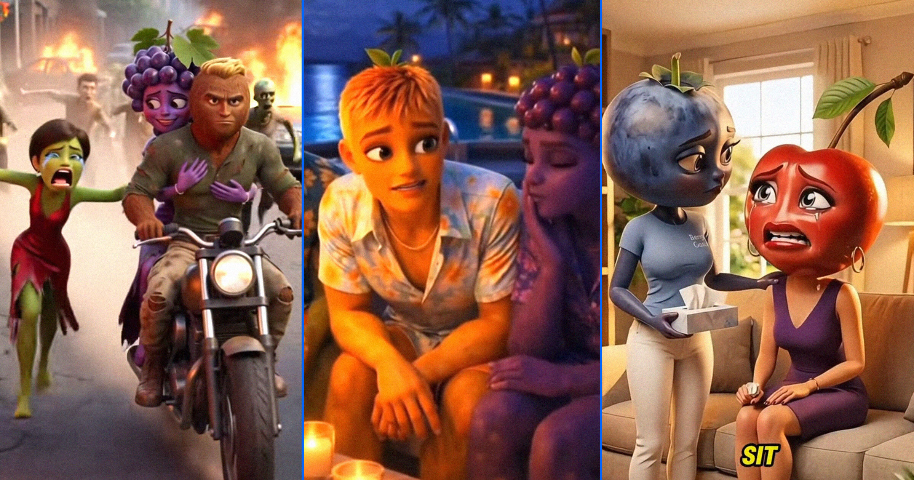

# 专家警告：AI垃圾正悄悄腐蚀孩子们的大脑

> AI内容质量参差不齐，可能影响孩子成长。

AI内容质量参差不齐，可能影响孩子成长。

## 现象背后的风险

近日，多位教育专家发出警告，指出当前网络上泛滥的低质量AI生成内容正在悄然侵蚀
孩子们的思维方式和学习能力。随着人工智能技术的发展与普及，不少家长开始担忧，
孩子们是否会被这些未经筛选的内容所误导。

## AI内容质量参差不齐

一项针对学生日常接触的AI文本进行的研究显示，许多生成的文章存在严重的逻辑错误
、语法缺陷以及信息偏差问题。这些看似有趣但实则低劣的信息可能会影响孩子的判断
力和创造力。专家建议，家长和学校应提高警惕，引导孩子正确使用网络资源。

## 为未来护航

面对这一挑战，社会各界正联手努力寻找解决方案。教育工作者呼吁加强AI内容审核机
制，同时鼓励孩子们培养批判性思维能力。让我们一起携手，为孩子们创造一个更加纯
净的学习环境吧！

---

## 微信 HTML

```html
<section class="article-content">
  <section style="padding: 12px 18px; border-left: 4px solid #DBDBDB; background-color: #f5f5f5; margin-bottom: 24px; border-radius: 2px;">
    <p style="line-height: 1.6; margin: 0; font-size: 15px; color: #888888;">AI内容质量参差不齐，可能影响孩子成长。</p>
  </section>
  <p style="line-height: 1.8; margin-bottom: 24px; text-align: center;"><strong><span style="color: #3daad6;">1、现象背后的风险</span></strong></p>
  <p style="line-height: 3; margin-bottom: 24px;">近日，多位教育专家发出警告，指出当前网络上泛滥的低质量AI生成内容正在悄然侵蚀
孩子们的思维方式和学习能力。随着人工智能技术的发展与普及，不少家长开始担忧，
孩子们是否会被这些未经筛选的内容所误导。</p>
  <p style="line-height: 1.8; margin-bottom: 24px; text-align: center;"><strong><span style="color: #3daad6;">2、AI内容质量参差不齐</span></strong></p>
  <p style="line-height: 3; margin-bottom: 24px;">一项针对学生日常接触的AI文本进行的研究显示，许多生成的文章存在严重的逻辑错误
、语法缺陷以及信息偏差问题。这些看似有趣但实则低劣的信息可能会影响孩子的判断
力和创造力。专家建议，家长和学校应提高警惕，引导孩子正确使用网络资源。</p>
  <p style="line-height: 1.8; margin-bottom: 24px; text-align: center;"><strong><span style="color: #3daad6;">3、为未来护航</span></strong></p>
  <p style="line-height: 3; margin-bottom: 24px;">面对这一挑战，社会各界正联手努力寻找解决方案。教育工作者呼吁加强AI内容审核机
制，同时鼓励孩子们培养批判性思维能力。让我们一起携手，为孩子们创造一个更加纯
净的学习环境吧！</p>
</section>
```
