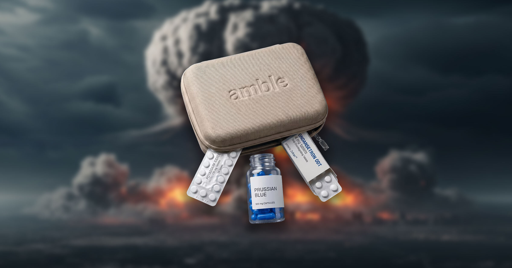

# 当世界末日来临，这家倒霉的创业公司竟推出了分期支付核辐射防护套件！

> 在核战争一触即发之际，买回家，以后再说吧！

在核战争一触即发之际，买回家，以后再说吧！

## 现实真能这么操作？

一家原本颇受争议的初创企业，竟然推出了一种核辐射防护套件，并提供分期付款服务
。这背后究竟隐藏着怎样的故事？

## 核武器下的生存指南

面对可能到来的“核末日”，这家创业公司试图用一种轻松的方式，帮助人们做好准备。
虽然听起来有点荒诞，但这份套件确实包含了在核灾难中保护自己的一些基本装备。

## 给未来的希望

在这个充满不确定性的世界里，这样的产品或许能带给我们一丝安慰。无论未来如何，
在这小小的一隅，我们依然可以保持一份从容和淡定。

---

## 微信 HTML

```html
<section class="article-content">
  <section style="padding: 12px 18px; border-left: 4px solid #DBDBDB; background-color: #f5f5f5; margin-bottom: 24px; border-radius: 2px;">
    <p style="line-height: 1.6; margin: 0; font-size: 15px; color: #888888;">在核战争一触即发之际，买回家，以后再说吧！</p>
  </section>
  <p style="line-height: 1.8; margin-bottom: 24px; text-align: center;"><strong><span style="color: #3daad6;">1、现实真能这么操作？</span></strong></p>
  <p style="line-height: 3; margin-bottom: 24px;">一家原本颇受争议的初创企业，竟然推出了一种核辐射防护套件，并提供分期付款服务
。这背后究竟隐藏着怎样的故事？</p>
  <p style="line-height: 1.8; margin-bottom: 24px; text-align: center;"><strong><span style="color: #3daad6;">2、核武器下的生存指南</span></strong></p>
  <p style="line-height: 3; margin-bottom: 24px;">面对可能到来的“核末日”，这家创业公司试图用一种轻松的方式，帮助人们做好准备。
虽然听起来有点荒诞，但这份套件确实包含了在核灾难中保护自己的一些基本装备。</p>
  <p style="line-height: 1.8; margin-bottom: 24px; text-align: center;"><strong><span style="color: #3daad6;">3、给未来的希望</span></strong></p>
  <p style="line-height: 3; margin-bottom: 24px;">在这个充满不确定性的世界里，这样的产品或许能带给我们一丝安慰。无论未来如何，
在这小小的一隅，我们依然可以保持一份从容和淡定。</p>
</section>
```
