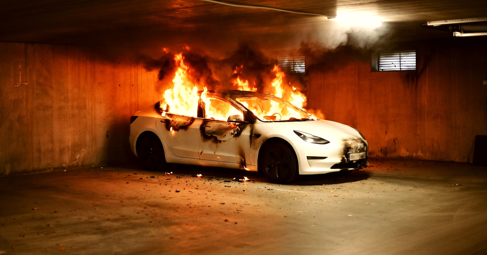

# 电动汽车起火，真的无解了吗？

> 新研究发现：目前几乎没有有效方法扑灭电动车火灾！

新研究发现：目前几乎没有有效方法扑灭电动车火灾！

## 难题重重

一项最新研究表明，在面对电动汽车火灾时，几乎找不到一种有效的灭火方式。这不禁
让人担心：如果发生意外，车主和救援人员该如何应对呢？

## 现实的困境

这项研究揭示了传统灭火器对电动汽车电池起火效果甚微的问题。专家建议，需要更多
针对电动车特性的新型灭火技术来解决这一难题。未来或许会有新的解决方案出现。
当夜晚来临，电动汽车安静地停在小区角落时，我们不禁思考，保护它们的安全究竟意
味着什么？

---

## 微信 HTML

```html
<section class="article-content">
  <section style="padding: 12px 18px; border-left: 4px solid #DBDBDB; background-color: #f5f5f5; margin-bottom: 24px; border-radius: 2px;">
    <p style="line-height: 1.6; margin: 0; font-size: 15px; color: #888888;">新研究发现：目前几乎没有有效方法扑灭电动车火灾！</p>
  </section>
  <p style="line-height: 1.8; margin-bottom: 24px; text-align: center;"><strong><span style="color: #3daad6;">1、难题重重</span></strong></p>
  <p style="line-height: 3; margin-bottom: 24px;">一项最新研究表明，在面对电动汽车火灾时，几乎找不到一种有效的灭火方式。这不禁
让人担心：如果发生意外，车主和救援人员该如何应对呢？</p>
  <p style="line-height: 1.8; margin-bottom: 24px; text-align: center;"><strong><span style="color: #3daad6;">2、现实的困境</span></strong></p>
  <p style="line-height: 3; margin-bottom: 24px;">这项研究揭示了传统灭火器对电动汽车电池起火效果甚微的问题。专家建议，需要更多
针对电动车特性的新型灭火技术来解决这一难题。未来或许会有新的解决方案出现。
当夜晚来临，电动汽车安静地停在小区角落时，我们不禁思考，保护它们的安全究竟意
味着什么？</p>
</section>
```
