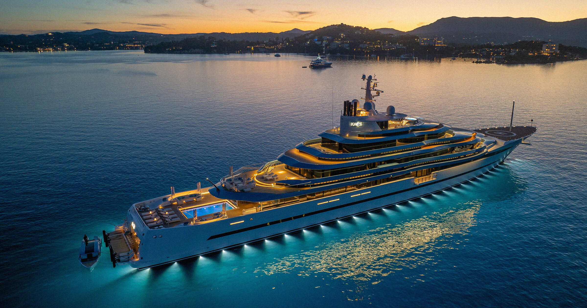

# AI富豪们如此贪婪，竞相推高游艇和私人飞机的销量！

> 他们似乎忘了社会责任感，只为了自己的私欲大肆推销奢华产品。

他们似乎忘了社会责任感，只为了自己的私欲大肆推销奢华产品。

## 究竟是什么原因？

近日，AI领域的亿万富翁们表现出了前所未有的贪婪——他们正在疯狂推动豪华游艇和私
人飞机的销售。这种现象的背后隐藏着什么动机呢？

## 富豪们的消费密码

这些富豪不仅享受奢华生活，还希望通过个人行为进一步扩大影响力。然而，这种奢侈
消费模式真的能为社会带来正面价值吗？我们不禁要问：当他们享受着无尽财富带来的
便利时，是否考虑过更多人的实际需求和福祉呢？
在追求个人奢华的同时，这样的做法是否会加剧社会不平等？我们或许需要更多的讨论
来寻求平衡。

