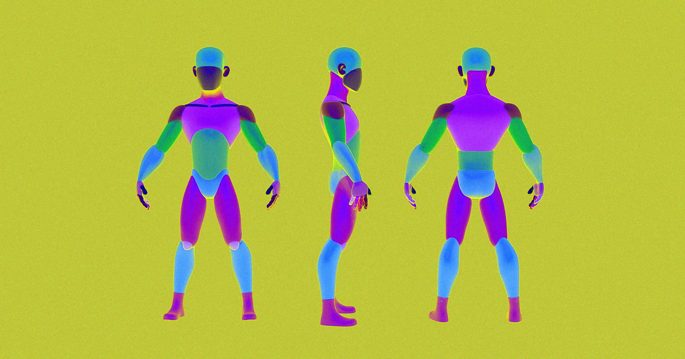

# AI生成的内容几乎毫无价值，经济已发声

> 经济已经明确表态：AI生成的东西基本没价值了！

经济已经明确表态：AI生成的东西基本没价值了！

## 这意味着什么？

经济通过各种数据和市场反馈告诉我们，那些由AI生成的产品或内容，在市场上几乎没
有多少价值。这引发了人们的深思：未来的内容创作会不会被彻底颠覆？

## 市场反应如何？

在刚刚过去的季度里，多款宣称使用AI技术生成的商品销量惨淡，甚至低于预期的十分
之一。这一现象让业内专家和投资者都开始重新审视AI技术在内容生产领域的实际价值
。
在这个充满变数的时代，唯一不变的是变革本身。

