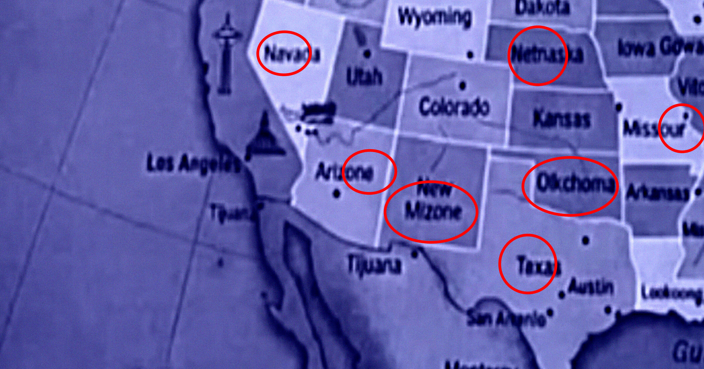

# 令人咋舌！肯塔基中学首日发来AI教材，竟把学生送回家了

> AI生成的教材荒谬至极，错别字和地名错误让人大跌眼镜！

AI生成的教材荒谬至极，错别字和地名错误让人大跌眼镜！

## 首日课堂惊现离奇失误？

今天是开学第一天，本应充满希望与期待的校园里却传来一个令人咋舌的消息——肯塔基
中学给学生们发放了AI生成的教育材料，结果这些材料充满了荒谬至极的错误。孩子们
回到家后，家长们都惊呆了。

## 一份份离谱教材曝光

仔细一看，这份“神作”简直让人无语：其中一幅地图上赫然出现了诸如“北达哈塔”和“
“奥尔科马”的地名，这简直是前所未闻的搞笑场面！此外，书中还充斥着无数语法错误
与拼写失误，让人不禁质疑AI生成内容的质量。

## 教育质量引热议

这样的错误不仅影响了学生的学习体验，更引发了家长和社会对当前教育技术应用背后
问题的关注。究竟何时才能让科技真正服务于教育而不成为笑话？这值得我们深思。

---

## 微信 HTML

```html
<section class="article-content">
  <section style="padding: 12px 18px; border-left: 4px solid #DBDBDB; background-color: #f5f5f5; margin-bottom: 24px; border-radius: 2px;">
    <p style="line-height: 1.6; margin: 0; font-size: 15px; color: #888888;">AI生成的教材荒谬至极，错别字和地名错误让人大跌眼镜！</p>
  </section>
  <p style="line-height: 1.8; margin-bottom: 24px; text-align: center;"><strong><span style="color: #3daad6;">1、首日课堂惊现离奇失误？</span></strong></p>
  <p style="line-height: 3; margin-bottom: 24px;">今天是开学第一天，本应充满希望与期待的校园里却传来一个令人咋舌的消息——肯塔基
中学给学生们发放了AI生成的教育材料，结果这些材料充满了荒谬至极的错误。孩子们
回到家后，家长们都惊呆了。</p>
  <p style="line-height: 1.8; margin-bottom: 24px; text-align: center;"><strong><span style="color: #3daad6;">2、一份份离谱教材曝光</span></strong></p>
  <p style="line-height: 3; margin-bottom: 24px;">仔细一看，这份“神作”简直让人无语：其中一幅地图上赫然出现了诸如“北达哈塔”和“
“奥尔科马”的地名，这简直是前所未闻的搞笑场面！此外，书中还充斥着无数语法错误
与拼写失误，让人不禁质疑AI生成内容的质量。</p>
  <p style="line-height: 1.8; margin-bottom: 24px; text-align: center;"><strong><span style="color: #3daad6;">3、教育质量引热议</span></strong></p>
  <p style="line-height: 3; margin-bottom: 24px;">这样的错误不仅影响了学生的学习体验，更引发了家长和社会对当前教育技术应用背后
问题的关注。究竟何时才能让科技真正服务于教育而不成为笑话？这值得我们深思。</p>
</section>
```
