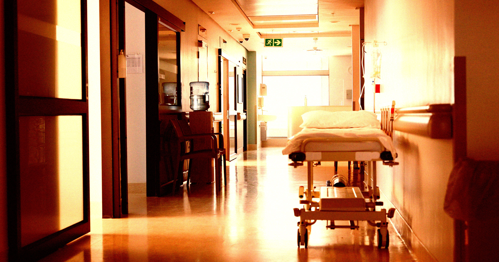

# 医院太热了，手术被取消，员工晕倒！这高温天气真让人头疼？

> 高温来袭，医院也“中暑”了吗？

高温来袭，医院也“中暑”了吗？

## 炎炎夏日下的危机

最近，多地气温破纪录飙升，让不少医院陷入了前所未有的困境。手术室内的温度持续
走高，原本应该在空调控制下的室内环境却成了热浪的温床。一些医院不得不紧急取消
了多场手术，以避免高温带来的风险。

## 医护人员“中暑”

更令人担忧的是，医护人员也纷纷中招，出现大量中暑症状。工作人员在酷热下工作几
个小时后，体力透支严重，甚至有人因体温过高而晕倒。这不仅给医院的正常运作带来
了巨大挑战，也让人们开始重新审视高温天气下的健康防护措施。

## 高温警告：守护健康从我做起

面对如此严峻的情况，每个人都应该提高警惕，采取有效措施应对高温带来的影响。无
论是加强个人防护还是寻求医院的支持与帮助，我们都不能掉以轻心。希望每个人都能
平安度夏，远离高温的侵袭！

