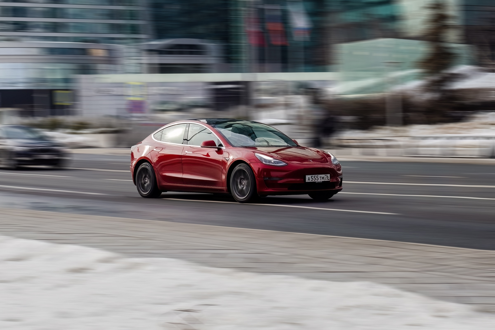

# 特斯拉自动驾驶惊魂记：车机执意驶离高速公路，记者险些坠入沟渠

> 记者在使用特斯拉FSD时遭遇意外情况，惊险万分。

记者在使用特斯拉FSD时遭遇意外情况，惊险万分。

## 难道自动驾驶也会犯错？

那天，我正驾驶着装备了FSD的特斯拉，在高速公路上享受自动驾驶带来的便捷。突然
，车辆似乎出现了问题——它不听指令，试图偏离主路，朝着前方的一个深沟驶去。我的
第一反应是：这可不是我想要的安全体验。

## 问题出在哪里？

在惊魂未定之际，我开始怀疑起FSD的稳定性和可靠性。虽然自动驾驶技术正逐步成熟
，但在实际操作中仍面临诸多挑战。这次事故让我更加警惕，在享受科技带来便利的同
时，也要时刻保持警觉。未来，我们期待更多技术创新能为出行带来更多安全与便捷。
正当我紧握方向盘，全神贯注地准备接管车辆时，幸运的是，特斯拉的冗余系统及时介
入，成功避免了险情的发生。这次经历提醒了我，科技发展尽管迅速，但我们在享受其
带来的便利时，依然需要保持警惕和谨慎。

---

## 微信 HTML

```html
<section class="article-content">
  <section style="padding: 12px 18px; border-left: 4px solid #DBDBDB; background-color: #f5f5f5; margin-bottom: 24px; border-radius: 2px;">
    <p style="line-height: 1.6; margin: 0; font-size: 15px; color: #888888;">记者在使用特斯拉FSD时遭遇意外情况，惊险万分。</p>
  </section>
  <p style="line-height: 1.8; margin-bottom: 24px; text-align: center;"><strong><span style="color: #3daad6;">1、难道自动驾驶也会犯错？</span></strong></p>
  <p style="line-height: 3; margin-bottom: 24px;">那天，我正驾驶着装备了FSD的特斯拉，在高速公路上享受自动驾驶带来的便捷。突然
，车辆似乎出现了问题——它不听指令，试图偏离主路，朝着前方的一个深沟驶去。我的
第一反应是：这可不是我想要的安全体验。</p>
  <p style="line-height: 1.8; margin-bottom: 24px; text-align: center;"><strong><span style="color: #3daad6;">2、问题出在哪里？</span></strong></p>
  <p style="line-height: 3; margin-bottom: 24px;">在惊魂未定之际，我开始怀疑起FSD的稳定性和可靠性。虽然自动驾驶技术正逐步成熟
，但在实际操作中仍面临诸多挑战。这次事故让我更加警惕，在享受科技带来便利的同
时，也要时刻保持警觉。未来，我们期待更多技术创新能为出行带来更多安全与便捷。
正当我紧握方向盘，全神贯注地准备接管车辆时，幸运的是，特斯拉的冗余系统及时介
入，成功避免了险情的发生。这次经历提醒了我，科技发展尽管迅速，但我们在享受其
带来的便利时，依然需要保持警惕和谨慎。</p>
</section>
```
