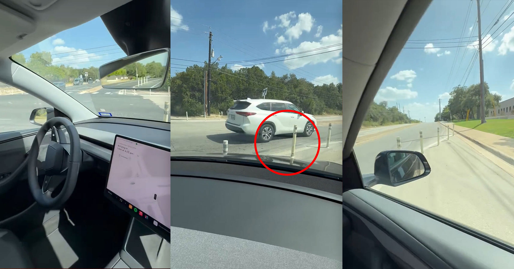

# Tesla 无人驾驶出租车无司机闯入交通隔离带，惊现城市街头！

> 马斯克的无人车真来了！无司机闯禁行！

马斯克的无人车真来了！无司机闯禁行！

## 独立驾驶，能否安全通行？

近日，有目击者在城市道路上拍到特斯拉机器人出租车（Robotaxi）的画面，车内竟然
没有乘客和司机。这辆无人驾驶车辆无视交通规则，径直冲破了道路隔离带，引发了广
泛关注。

## 无人车技术现状如何？

目前，特斯拉正在积极研发自动驾驶技术，并且已经多次展示了其进展。然而，在实际
道路上无司机的Robotaxi出现还是首次引起轰动。尽管技术不断进步，但无人驾驶车辆
的安全性和可靠性仍需进一步验证。

## 未来交通的无限可能

这次事件再次引发了人们对无人驾驶汽车未来的讨论。或许在不久的将来，我们真的能
在街头见到无需人类干预就能安全行驶的汽车。但这背后的安全问题和技术挑战依然值
得深思。

---

## 微信 HTML

```html
<section class="article-content">
  <section style="padding: 12px 18px; border-left: 4px solid #DBDBDB; background-color: #f5f5f5; margin-bottom: 24px; border-radius: 2px;">
    <p style="line-height: 1.6; margin: 0; font-size: 15px; color: #888888;">马斯克的无人车真来了！无司机闯禁行！</p>
  </section>
  <p style="line-height: 1.8; margin-bottom: 24px; text-align: center;"><strong><span style="color: #3daad6;">1、独立驾驶，能否安全通行？</span></strong></p>
  <p style="line-height: 3; margin-bottom: 24px;">近日，有目击者在城市道路上拍到特斯拉机器人出租车（Robotaxi）的画面，车内竟然
没有乘客和司机。这辆无人驾驶车辆无视交通规则，径直冲破了道路隔离带，引发了广
泛关注。</p>
  <p style="line-height: 1.8; margin-bottom: 24px; text-align: center;"><strong><span style="color: #3daad6;">2、无人车技术现状如何？</span></strong></p>
  <p style="line-height: 3; margin-bottom: 24px;">目前，特斯拉正在积极研发自动驾驶技术，并且已经多次展示了其进展。然而，在实际
道路上无司机的Robotaxi出现还是首次引起轰动。尽管技术不断进步，但无人驾驶车辆
的安全性和可靠性仍需进一步验证。</p>
  <p style="line-height: 1.8; margin-bottom: 24px; text-align: center;"><strong><span style="color: #3daad6;">3、未来交通的无限可能</span></strong></p>
  <p style="line-height: 3; margin-bottom: 24px;">这次事件再次引发了人们对无人驾驶汽车未来的讨论。或许在不久的将来，我们真的能
在街头见到无需人类干预就能安全行驶的汽车。但这背后的安全问题和技术挑战依然值
得深思。</p>
</section>
```
