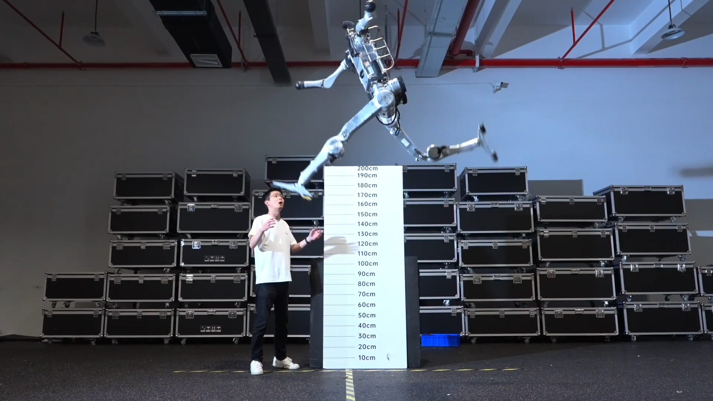

# 宇树新机器人跑得比博尔特还快，但那走路姿态，看着像噩梦

> 中国机器人公司宇树发布代号"超人"的人形机器人，最高速度超过博尔特百米纪录，却因其诡异的爬行式步态引发争议。

中国人形机器人公司宇树，又一次把"炫技"玩到了新高度——只是这次，看的人有点后背发凉。

## 跑得比人类史上最快的人还快

周一，宇树正式亮出代号为"超人"的新一代人形机器人，并照例用一段营销视频把它的运动天赋吹上了天。

在三十秒的演示里，这台机器人腾空跃起约两米高，远超吉尼斯纪录中 1.7 米的人类站立跳高度。更狠的是速度：宇树声称它在跑道上的最高时速达到每秒 12.66 米。作为对比，博尔特在 2009 年创下 9.58 秒百米纪录时，瞬时最高速度也不过每秒 12.2 米左右——也就是说，这台机器人在直线冲刺上，真把"世界上跑得最快的人"甩在了身后。

宇树在社交媒体上颇有几分得意："这台机器从立项到成型只用了三个多月，接下来还有很大的提升空间。"

## 那步态，真的有点瘆人

但别急着鼓掌。看过视频的人普遍被它独特的"小碎步"步态劝退——一种急促、贴地、几乎像在爬行挪动的动作，怎么看都和"超人"这两个字不搭边，反倒更像什么不祥之物在贴地疾行。

宇树选在这个节点发布，时机也耐人寻味。就在一周前，公司刚完成一轮备受瞩目的 IPO，募资超过 9 亿美元，即将登陆上海证券交易所。外界普遍认为，这可能只是中国科技企业集中上市潮的开端。

## 炫技背后，是生意也是赛道

这个月 22 日，上海的世界人形机器人运动会即将开幕，宇树是绝对的主角。去年的首届赛事里，它包揽了 100 米、400 米、1500 米以及 4×100 米接力四枚金牌。目前还不清楚"超人"是宇树的新产品线，还是专为这次比赛打造的性能特化版本。

和许多中国机器人公司一样，宇树一直靠吸睛的噱头刷存在感：机器人打武术、和真人孩童同台表演高难度翻腾动作，都曾让世界惊掉下巴。

不得不承认，它们确实跑到了人类前面。只是当这台"超人"贴着地面向你冲来时，你第一反应可能不是喝彩，而是想先退后两步。

## 封面图

