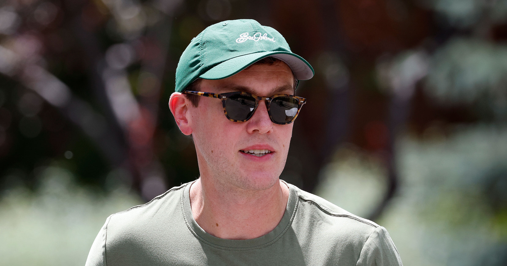

# Flock暂时告别媒体请求，背后藏着什么故事？

> 它为何选择暂停回应？

它为何选择暂停回应？

## Flock为何按下“暂停键”？

最近，Flock发布了一则声明，表示将暂时停止回应所有媒体的采访请求。这一决定背
后的动机让人好奇，公司究竟遇到了哪些难题？又或是为了聚焦内部发展？无论如何，
这无疑为外界揭开了一层面纱。

## 媒体沉默的背后

或许，Flock正面临产品迭代的巨大压力，亦或是市场环境变化导致的调整。不论原因
如何，这次“休假”可能会给用户留下诸多猜测与想象的空间。在这个关键时刻，Flock
Flock的选择究竟是暂时休整，还是长远布局？

## 一切只是开始

不论是暂停回复媒体请求，还是其他未知的变化，都预示着新的篇章正在开启。我们不
妨静待其变，也许在不久的将来，Flock会以更加完美的姿态重新出现在公众视野中，
带来更多惊喜与突破！

