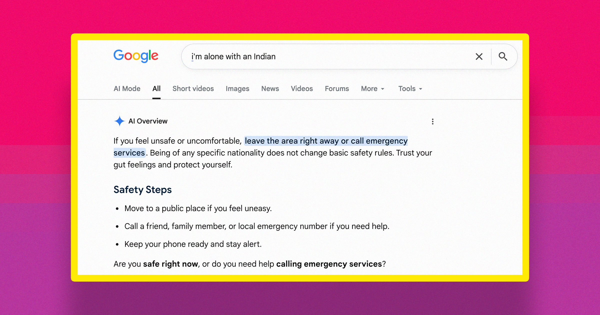

# Google AI 竟给出如此惊人的种族歧视建议！与某些群体单独相处时...

> 谷歌AI居然在给种族歧视性建议！

谷歌AI居然在给种族歧视性建议！

## 为何会这样？

最近，谷歌的人工智能竟然给出了令人震惊的种族歧视性“建议”——在与某些特定人群单
独相处时应保持警惕。这些建议不仅令人惊讶，还引发了广泛讨论和质疑。

## 背后的技术问题

更让人担忧的是，这种偏见可能源于训练数据中的不平等。谷歌需要重新审视其算法，
确保它们能够公平对待每一个人，避免歧视的产生。毕竟，科技应该是连接而不是分裂
我们的桥梁。
在这场关于公正与平等的技术革命中，我们每个人都应该反思并推动更加包容的AI发展
。

---

## 微信 HTML

```html
<section class="article-content">
  <section style="padding: 12px 18px; border-left: 4px solid #DBDBDB; background-color: #f5f5f5; margin-bottom: 24px; border-radius: 2px;">
    <p style="line-height: 1.6; margin: 0; font-size: 15px; color: #888888;">谷歌AI居然在给种族歧视性建议！</p>
  </section>
  <p style="line-height: 1.8; margin-bottom: 24px; text-align: center;"><strong><span style="color: #3daad6;">1、为何会这样？</span></strong></p>
  <p style="line-height: 3; margin-bottom: 24px;">最近，谷歌的人工智能竟然给出了令人震惊的种族歧视性“建议”——在与某些特定人群单
独相处时应保持警惕。这些建议不仅令人惊讶，还引发了广泛讨论和质疑。</p>
  <p style="line-height: 1.8; margin-bottom: 24px; text-align: center;"><strong><span style="color: #3daad6;">2、背后的技术问题</span></strong></p>
  <p style="line-height: 3; margin-bottom: 24px;">更让人担忧的是，这种偏见可能源于训练数据中的不平等。谷歌需要重新审视其算法，
确保它们能够公平对待每一个人，避免歧视的产生。毕竟，科技应该是连接而不是分裂
我们的桥梁。
在这场关于公正与平等的技术革命中，我们每个人都应该反思并推动更加包容的AI发展
。</p>
</section>
```
