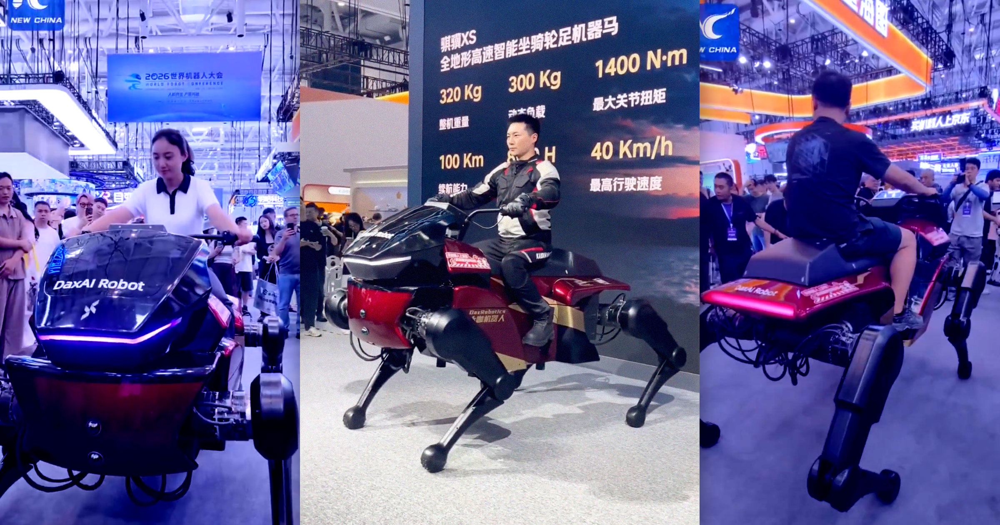

# 中国初创公司推出可骑乘的机器人马，未来已来！

> 中式传统与科技融合的新奇体验！

中式传统与科技融合的新奇体验！

## 真的能骑的机器人马？！

国内一家创业公司最近展示了他们研发的可真正上身驾驭的机器人马匹，这不仅是技术
的突破，更是未来科技融入日常生活的一个缩影。

## 无需想象，只需体验

这款机器人马不仅在外形上完美复刻了真实马匹的模样，更重要的是它能够让人真正骑
上去。通过先进的传感器和人工智能系统，这匹“马”能够模拟真实的骑行感受，包括上
下颠簸和左右摇晃。用户在骑乘过程中仿佛置身于自然之中，完全享受着科技带来的乐
趣。

## 未来已来

随着技术的进步，这样的机器人不仅可能用于娱乐领域，还能应用于康复治疗、教育等
多个方面。想象一下，在不久的将来，你也能骑上这样的一匹“马”，在虚拟的世界里感
受现实般的冒险与挑战，这或许就是未来的开始吧！

