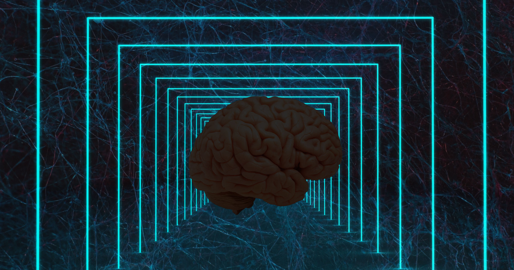

# 一篇大胆新论文质疑人类大脑能否产生意识

> 科学家提出惊人论点：人类大脑并非制造意识的源泉。

科学家提出惊人论点：人类大脑并非制造意识的源泉。

## 这篇论文到底在说什么？

近期，一项激进的研究声称，我们 [K 对意识的理解可能需要彻底颠覆。根据这项新论文的观点，人脑并不能产生所谓的‘意 [K 识’。

## 传统观念中的大脑与意识

长久以来，人们普遍认为意识是大 [K 脑活动的直接结果。然而，这篇论文提出了一种全新的观点，挑战了我们现有的认知框 [K 架。

## 意识从何而来？

那么，如果人类大脑不是意识产生的根源， [K 意识是从哪里来的呢？这项研究或许会引发一场关于哲学和科学的激烈讨论。

---

## 微信 HTML

```html
<section class="article-content">
  <section style="padding: 12px 18px; border-left: 4px solid #DBDBDB; background-color: #f5f5f5; margin-bottom: 24px; border-radius: 2px;">
    <p style="line-height: 1.6; margin: 0; font-size: 15px; color: #888888;">科学家提出惊人论点：人类大脑并非制造意识的源泉。</p>
  </section>
  <p style="line-height: 1.8; margin-bottom: 24px; text-align: center;"><strong><span style="color: #3daad6;">1、这篇论文到底在说什么？</span></strong></p>
  <p style="line-height: 3; margin-bottom: 24px;">近期，一项激进的研究声称，我们 [K 对意识的理解可能需要彻底颠覆。根据这项新论文的观点，人脑并不能产生所谓的‘意 [K 识’。</p>
  <p style="line-height: 1.8; margin-bottom: 24px; text-align: center;"><strong><span style="color: #3daad6;">2、传统观念中的大脑与意识</span></strong></p>
  <p style="line-height: 3; margin-bottom: 24px;">长久以来，人们普遍认为意识是大 [K 脑活动的直接结果。然而，这篇论文提出了一种全新的观点，挑战了我们现有的认知框 [K 架。</p>
  <p style="line-height: 1.8; margin-bottom: 24px; text-align: center;"><strong><span style="color: #3daad6;">3、意识从何而来？</span></strong></p>
  <p style="line-height: 3; margin-bottom: 24px;">那么，如果人类大脑不是意识产生的根源， [K 意识是从哪里来的呢？这项研究或许会引发一场关于哲学和科学的激烈讨论。</p>
</section>
```

## 封面图
