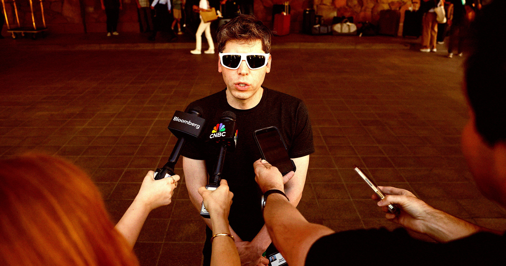

# 人工智能行业为何形象受损如此严重？

> AI行业发展陷入公众信任危机，原因何在？

AI行业发展陷入公众信任危机，原因何在？

## 公众对AI的误解从哪里来？

当人们谈论起人工智能时，常常想到的是机器人取代工人的场景。这 [K 种刻板印象是否反映了真实情况？

## 数据泄露与隐私保护失守

每当爆出又一起数据泄露事件，AI行业的信任之桥便被狠狠敲打一记 [K 。如何保证用户信息安全已成为亟待解决的问题。

## 技术误用引发社会担忧

面部识别技术、算法偏见……这些都让公众感到恐慌与不安。人工智能 [K 真的像我们想象的那样安全吗？

## 封面图
