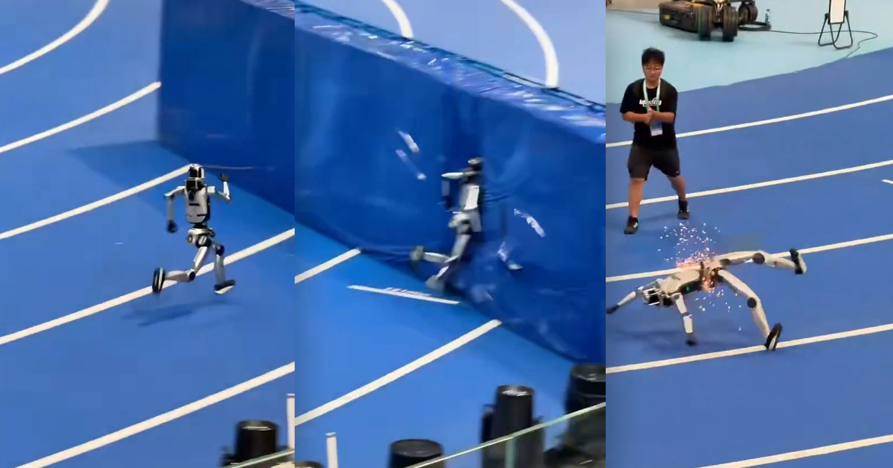

# 你见过最神奇的机器人死亡吗？这绝对是我们的第一选择

> 这绝对是我们见过最令人惊讶的机器人死亡场景。

这绝对是我们见过最令人惊讶的机器人死亡场景。

## 这台机器人究竟经历了什么？

想象一下，一台看似普通的机 [K 器人突然从静止到动作狂野的瞬间。当工程师试图关闭它时，事情竟然变得如此戏剧化 [K ！

## 背后的技术细节是怎样的？

其实，这场死亡并不是简单的机 [K 械故障。研究者发现，它是由于新升级后的软件导致的。这次事件提醒我们，科技的发 [K 展同样充满了未知和挑战。

## 未来机器人会有怎样命运？

尽管这次事故令人震惊，但它也 [K 引发了对未来机器人的深刻思考。或许，在未来的某一天，它们也会像人类一样经历生 [K 老病死。

---

## 微信 HTML

```html
<section class="article-content">
  <section style="padding: 12px 18px; border-left: 4px solid #DBDBDB; background-color: #f5f5f5; margin-bottom: 24px; border-radius: 2px;">
    <p style="line-height: 1.6; margin: 0; font-size: 15px; color: #888888;">这绝对是我们见过最令人惊讶的机器人死亡场景。</p>
  </section>
  <p style="line-height: 1.8; margin-bottom: 24px; text-align: center;"><strong><span style="color: #3daad6;">1、这台机器人究竟经历了什么？</span></strong></p>
  <p style="line-height: 3; margin-bottom: 24px;">想象一下，一台看似普通的机 [K 器人突然从静止到动作狂野的瞬间。当工程师试图关闭它时，事情竟然变得如此戏剧化 [K ！</p>
  <p style="line-height: 1.8; margin-bottom: 24px; text-align: center;"><strong><span style="color: #3daad6;">2、背后的技术细节是怎样的？</span></strong></p>
  <p style="line-height: 3; margin-bottom: 24px;">其实，这场死亡并不是简单的机 [K 械故障。研究者发现，它是由于新升级后的软件导致的。这次事件提醒我们，科技的发 [K 展同样充满了未知和挑战。</p>
  <p style="line-height: 1.8; margin-bottom: 24px; text-align: center;"><strong><span style="color: #3daad6;">3、未来机器人会有怎样命运？</span></strong></p>
  <p style="line-height: 3; margin-bottom: 24px;">尽管这次事故令人震惊，但它也 [K 引发了对未来机器人的深刻思考。或许，在未来的某一天，它们也会像人类一样经历生 [K 老病死。</p>
</section>
```

## 封面图
