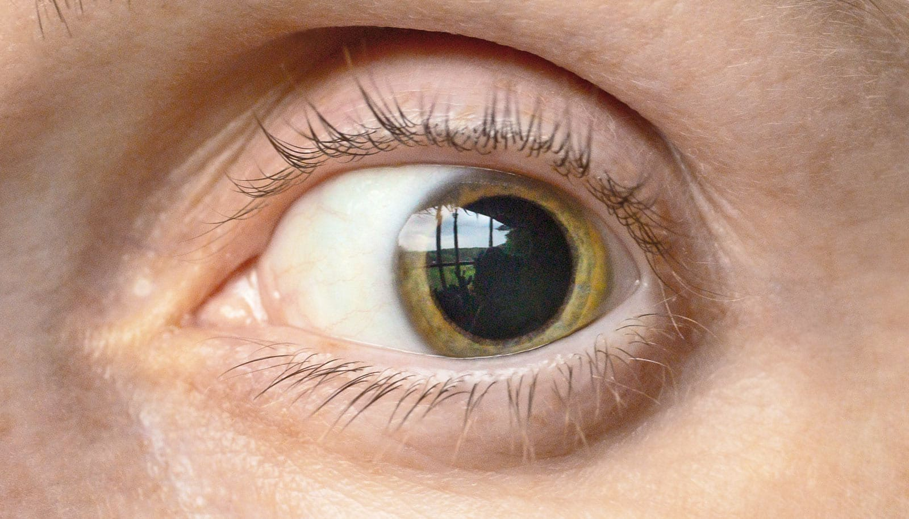

# 遇到惊喜为什么要睁大眼：大脑其实是在“刷新上下文”

> 布朗大学新研究称，遇到出乎意料的信息时，瞳孔放大并不是惊讶的副作用，而是大脑为“切换模式”准备的一次刷新——抛开旧框架、迎接新环境。

 一次惊喜，大脑在 0.1 秒内完成一次“清盘”。

## 瞳孔扩张 ≠ 惊讶

遇到出人意料的事，你的瞳孔会自动放大。以为这是惊讶的反应，然而布朗大学卡尼脑科学研究所的 Matt Nassar 教授认为，背后的真实含义是：大脑在快速切换模式。

> “瞳孔扩张代表着唤醒度飙升，”Nassar 说。“我们的研究支持这样的观点：这些快速波动，其实在大脑里正在发挥作用——帮人应对环境一刻一刻在改变的世界。”

## 棕色激素，棕色动脉？

论文发表在《Nature Human Behaviour》上。其实这个“刷新”是靠身体里的化学信号在操盘——主要是 locus coeruleus 释放的去甲肾上腺素（norepinephrine），也就是 fight-or-flight 通路的“掌柜”。

Nassar 解释道：

> “当遇到惊喜的时候，去甲肾上腺素飙升，就像一次刷新机制——大脑正在接收到改变预期的新信息。”

> “大脑先是保持着某种心理上下文，等到意识到‘我可能处在一个新场景’，便会抛弃旧有的那套，为学习做准备。”

## 怎么做实验？

63 位志愿者被请来做一个“猜颜色”游戏：

- 屏幕上出现彩色方块，让他们猜猜下一个会出现什么；
- 实际结果一出来，要么“撞上预期”，要么“刷地一下刷新”；
- 研究人员同时记录瞳长变化 + EEG 脑波。

结果：

- **出人意料的颜色 → 瞳孔放大 + 特定脑波放大**；
- 并且这些生理信号对应着“降低认知偏向 + 快速调整学习”。

换句话说：

> 见到意料之外的东西，大脑立马刷新，扔掉旧有的“思维惯性”，才能更好地吸收新的信息。

## 生活启示

其实没那么抽象。当你遇上一个彻头彻尾出乎意料的惊喜（比如前男友突然转账 1000 块），你的大脑就在那一刻，放弃“他应该是个游手好闲的人”这个既有的模型，从零开始重新学习。

## 总结一下

> “改变瞳孔直径，和特定 EEG 信号，就是大脑在‘装载新情景’的外部标记。它限制住旧情景对感知的干扰，然后给出一块干净的板子——这样才能学得更快。”

研究由美国国家精神卫生研究所(NIMH)资助。

<aside>Source: Futurity / Brown University</aside>
