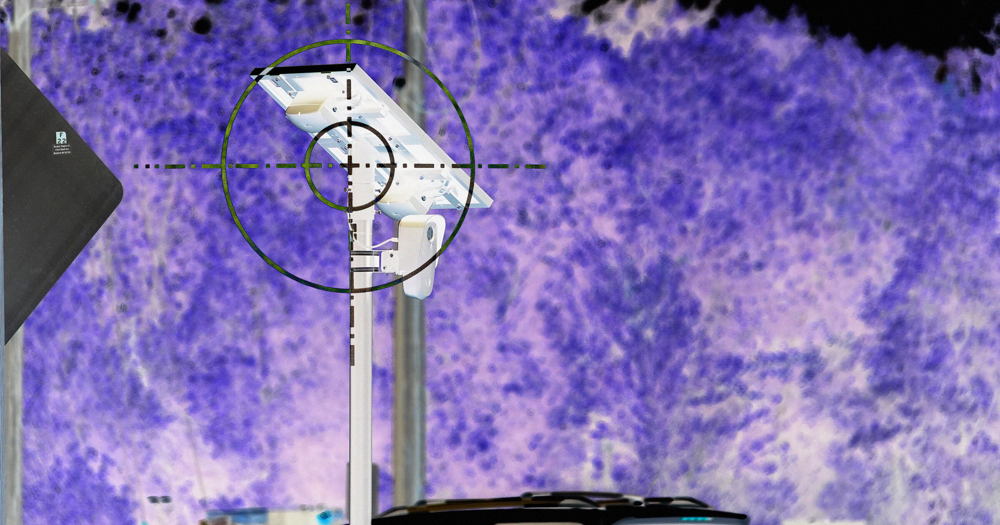

# 男子被拍毁坏羊栏杆，竟未获罪！这事儿咋了？

> 一起闹市中的意外事件，最终却不了了之。

一起闹市中的意外事件，最终却不了了之。

## 这事儿为啥没下文？

最近，一段视频在网上传播开来。画面 [K 中，一名男子破坏了一个羊栏杆，但最后竟没有受到法律制裁。这让不少人感到困惑： [K 这样的行为竟然能逃过处罚吗？

## 背后的故事是啥？

原来，这名男子只是误以为该羊栏属于流 [K 浪动物收容所的财产。他以为自己在做好事，结果却无意中触犯了法律。这起事件背后 [K 的真相令人唏嘘不已。

## 这个结果背后的意义是什么？

最终，地方检方决定不对这名 [K 男子提起诉讼。这是否意味着法律会放过那些出于好意却误入歧途的人呢？这是一个值 [K 得深思的话题。

## 封面图
