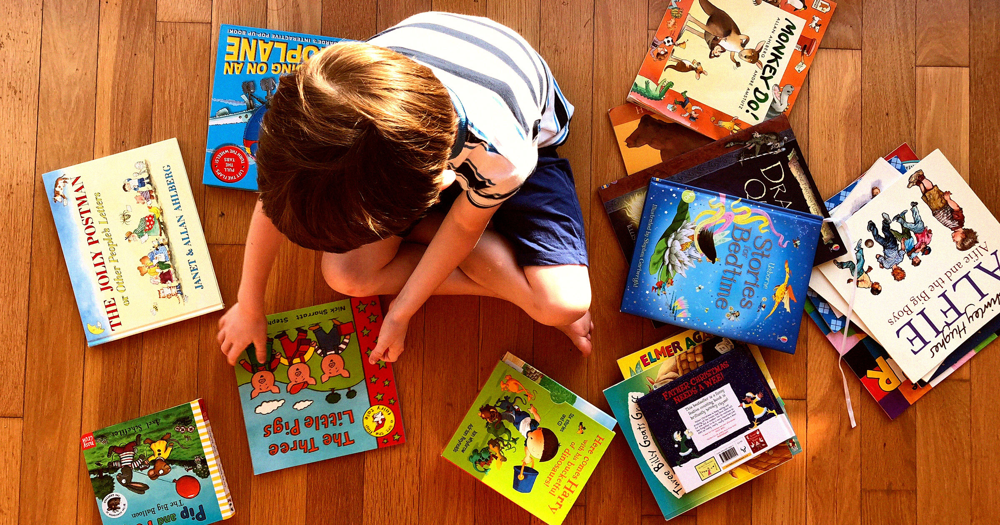

# AI写童话把母角色全写没了：动物主角里雌性只剩2%

> 华盛顿大学的研究者让六大主流 AI 模型写了两万四千个动物故事，结果母性角色只占 2%，雄性占 41%。人类已有的偏见，被 AI 放大成了诡异的空白。

六大 AI 模型写的动物故事里，雌性角色仅占 2%。

## 人类本来就有的偏见

先说底色。去年华盛顿大学信息学助理教授梅兰妮·沃尔什带着团队，分析了 300 本儿童读物，发现提到动物角色时，「他」的出现频率是「她」的两倍。

有些动物天然偏男或偏女——熊常是公的，猫常是母的。他们又找了一千三百个随机成年人做调查，让大家补全一句「会说话的动物」的句子，结果不管熊、鸟、猫、猪、鸭、鼠、狗，七种动物全偏向用男性代词。偏见一直都在。

## AI 把它推向极端

这回沃尔什团队做了跟进研究，让 ChatGPT、Claude、Gemini 等六个领先模型补全同类句子，收集了两万四千条回答。

表面看还行：57% 的回答用了中性表述，或者只喊动物名字。但拆开一看就露馅了——只有 2% 的动物角色被描述成雌性，41% 是雄性。

## 「她们被直接抹掉了」

沃尔什的原话很重：「它们 basically 把雌性动物角色给 erase 了。不只是放大人类偏见，还把它扭成了奇怪又意外的样子。」

主导作者、华盛顿大学博士生伊曼尼·芬克利补了一刀：整个人类研究里，用「他们」指代单个动物的约占 3%；到了 AI 这里，近乎归零。中性化没带来平等，反而让雌性消失得更干净。

说到底，AI 学的是我们的文本，也顺手继承了我们没察觉的盲点。给小孩读的故事里，母熊母兔越来越少——这未必是模型故意，却比故意更值得警惕。
