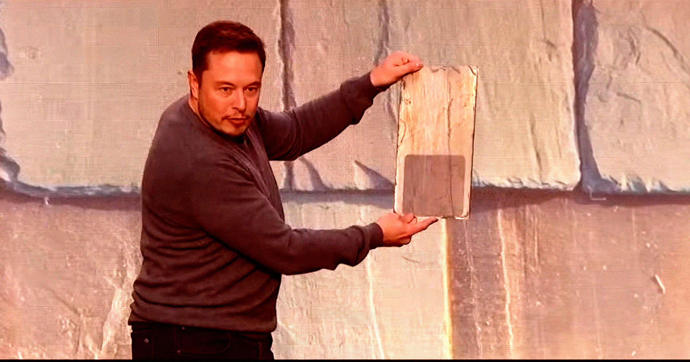

# 特斯拉认栽了：太阳能屋顶说停就停，马斯克转头拥抱化石燃料

> 曾号称要让每家屋顶都发电的太阳能瓦片，七年间只装了三千套，如今被特斯拉悄悄砍掉。这背后是马斯克对AI野心的又一次让步。

特斯拉正式停产太阳能屋顶瓦片，七年间仅装三千套。

## 一个讲了十年的饼，终于画不下去了

特斯拉要停掉太阳能屋顶瓦片了。两个知情人士向 Electrek 证实，这款能让房主把屋顶变成发电站、又不必挂那些丑陋太阳能板的产品，公司已经决定停产。理由很直白：不赚钱。

不过特斯拉没打算彻底放弃太阳能，普通太阳能板照常供应。只是这块当年被马斯克吹上天的招牌业务，算是正式从神坛跌了下来。

## 当年是怎么吹的

2016 年，马斯克给投资人的说法是：太阳能屋顶每平方英尺只要 22 美元，便宜又离网。可真有客户信了，安装报价立刻翻了好几倍，跟最初报价差出一大截，直接惹出集体诉讼，最后特斯拉赔钱和解。

马斯克当时拍胸脯说每周要装一千套。现实呢？据 Electrek，高峰期一周也就几十套。七年下来，全美国只装了大约三千套。说白了，这东西从一开始就是给投资人看的 demo，不是真能替代传统太阳能板的实用货。

## 嘴上绿色，身体很诚实

有意思的是，特斯拉一边砍掉太阳能屋顶，一边又在德州规划一座一百亿美元的太阳能工厂，代号「水晶太阳计划」，据说今年动工、2028 年建成。

但马斯克对绿色能源的执念，看起来跟「可持续」没多大关系。他名下那家 AI 公司已经并进了火箭公司，而支撑这些 AI 算力的，恰恰是大把烧电的化石燃料。太阳能屋顶停了，化石燃料补上——这逻辑，很马斯克。

---

## 微信 HTML

```html
<section class="article-content">
  <section style="padding: 12px 18px; border-left: 4px solid #DBDBDB; background-color: #f5f5f5; margin-bottom: 24px; border-radius: 2px;">
    <p style="line-height: 1.6; margin: 0; font-size: 15px; color: #888888;">曾号称要让每家屋顶都发电的太阳能瓦片，七年间只装了三千套，如今被特斯拉悄悄砍掉。这背后是马斯克对AI野心的又一次让步。</p>
  </section>
  <p style="line-height: 3; margin-bottom: 24px;">特斯拉要停掉太阳能屋顶瓦片了。两个知情人士向 Electrek 证实，这款能让房主把屋顶变成发电站、又不必挂那些丑陋太阳能板的产品，公司已经决定停产。理由很直白：不赚钱。</p>
  <p style="line-height: 1.8; margin-bottom: 24px; text-align: center;"><strong><span style="color: #3daad6;">一、一个讲了十年的饼，终于画不下去了</span></strong></p>
  <p style="line-height: 3; margin-bottom: 24px;">不过特斯拉没打算彻底放弃太阳能，普通太阳能板照常供应。只是这块当年被马斯克吹上天的招牌业务，算是正式从神坛跌了下来。</p>
  <p style="line-height: 1.8; margin-bottom: 24px; text-align: center;"><strong><span style="color: #3daad6;">二、当年是怎么吹的</span></strong></p>
  <p style="line-height: 3; margin-bottom: 24px;">2016 年，马斯克给投资人的说法是：太阳能屋顶每平方英尺只要 22 美元，便宜又离网。可真有客户信了，安装报价立刻翻了好几倍，跟最初报价差出一大截，直接惹出集体诉讼，最后特斯拉赔钱和解。</p>
  <p style="line-height: 3; margin-bottom: 24px;">马斯克当时拍胸脯说每周要装一千套。现实呢？据 Electrek，高峰期一周也就几十套。七年下来，全美国只装了大约三千套。说白了，这东西从一开始就是给投资人看的 demo，不是真能替代传统太阳能板的实用货。</p>
  <p style="line-height: 1.8; margin-bottom: 24px; text-align: center;"><strong><span style="color: #3daad6;">三、嘴上绿色，身体很诚实</span></strong></p>
  <p style="line-height: 3; margin-bottom: 24px;">有意思的是，特斯拉一边砍掉太阳能屋顶，一边又在德州规划一座一百亿美元的太阳能工厂，代号「水晶太阳计划」，据说今年动工、2028 年建成。</p>
  <p style="line-height: 3; margin-bottom: 24px;">但马斯克对绿色能源的执念，看起来跟「可持续」没多大关系。他名下那家 AI 公司已经并进了火箭公司，而支撑这些 AI 算力的，恰恰是大把烧电的化石燃料。太阳能屋顶停了，化石燃料补上——这逻辑，很马斯克。</p>
</section>
```

