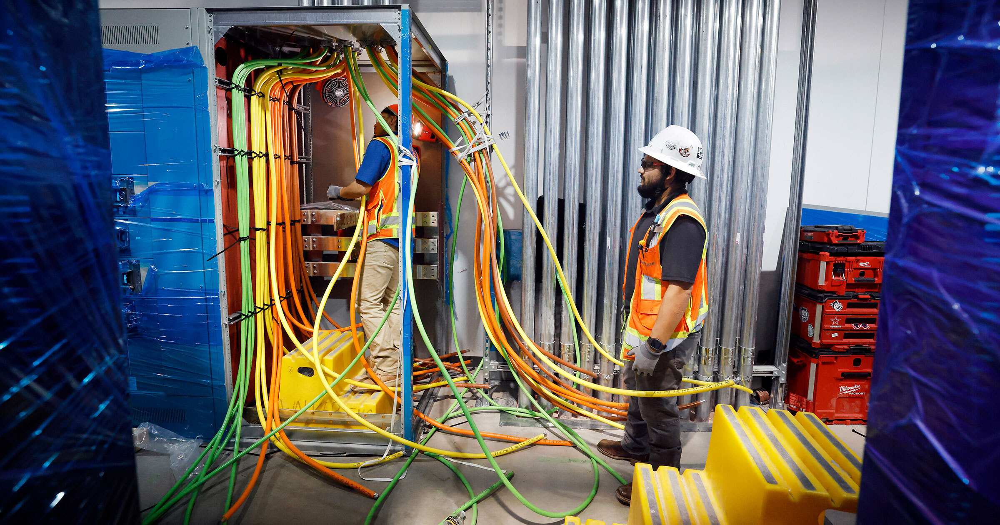

# AI数据中心正在抽干建筑工，以后可能连房子都没人盖了

> 全美住房开工跌到三年半新低，专家把锅甩给了疯抢工人的AI数据中心。

 房子买不起还不够，现在可能连盖房子的人都要被AI抢光了。

## 住房市场雪上加霜

本周早些时候，彭博社报道称，美国成屋待售量跌到了三年来的最低点，新房开工量也在7月骤降至三年半以来的谷底。两件事叠在一起，说明这个国家的住房市场远没有看上去那么乐观。

通胀压不住、工资原地踏步，这些老问题当然在拖累供需两端。但有一个新变量正在添乱：AI数据中心。

## 技术工人被数据中心"吸"走了

据政策媒体 Center Square 报道，为了赶上这波AI热潮，各地疯建算力设施，结果顺手把本该去盖房子的技术工人全卷走了。

Home Builders Institute 的CEO Ed Brady 在接受采访时说，美国技术工种整体已经缺了大约30万人。而那点勉强还能动的人，正一股脑涌向科技行业那些新建的数据中心。"市场没那么强，"Brady 直言，"所以今天很多原来干住房的人，都跑去数据中心了。"

## 这坑只会越挖越深

Brady 提醒，建筑业的劳动力从2008年大衰退起就一路走低，而数据中心这波建设潮只会让情况更糟，而且短期内看不到头。

"这个问题会因为数据中心的建设，在住房行业被放大得越来越尖锐，"他接着说，"而我们根本没有投入足够资金去培养下一代技术工人。"

换句话说，AI 的厂房越盖越多，普通人能住的房子却可能越来越少——这笔账，最后还是买房人买单。
