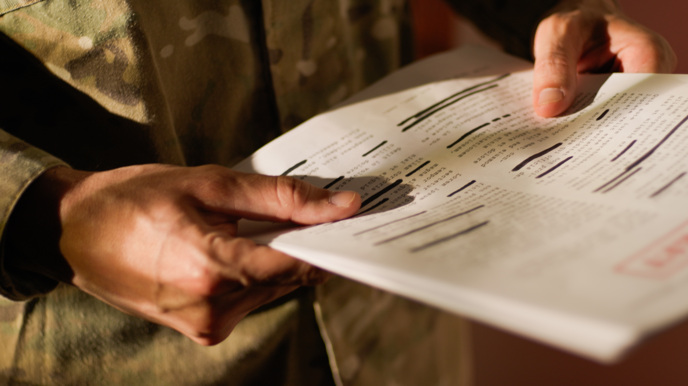

# Polymarket 上的内幕交易，正在把美军军事机密摆上赌桌

> 非营利机构调查发现，150多个钱包在 Polymarket 上靠美军内部情报下注，专家担心军事机密正被一点点泄露。

 今年一连串丑闻把预测市场上的政府与军方内幕交易推上风口浪尖，有人甚至已经坐牢。

## 比想象中更猖獗

但非营利研究组织 Anti-Corruption Data Collective（ACDC）的最新调查暗示，这潭水比我们想的深得多。据路透社报道，分析发现 Polymarket 上可能有超过150个钱包，在利用美国军方内部信息交易——专家担心，这种做法正在危及军事机密。Polymarket 没有回应路透社的置评请求。

ACDC 把注意力放在"冷门赌注"上：单笔至少2500美元、赔率不高于35%的下注，一旦押中回报惊人。在梳理了截至5月5日所有已结算的市场后，他们揪出566个被叫做"虎鲸"（orcas）的钱包——名字取自虎鲸那种精准、有意的捕猎方式。这些"虎鲸"通常在新开账户上押一笔暴利冷门单，套现后人间蒸发。

## 97%胜率的"虎鲸"

它们狠到什么程度？ACDC 发现，这些虎鲸账户里有152个押注过军事相关市场，平均胜率高达97.2%，合计卷走800万美元。ACDC 说，其中很多钱包此前连其他研究者和媒体都没标记过。

机构补充，肯定还有更多用更小金额、更长时间跨度牟利的内幕账户，但这些虎鲸是最嚣张的一批。

## 赌注本身就在泄露机密

除了发战争财的伦理问题，ACDC 警告这可能直接暴露军事机密。就像鲨鱼闻血，敏锐的市场观察者盯上这些诡异的冷门大单，会引发一波跟风下注，反而把赌局预测的结果昭告天下。ACDC 举例：有只虎鲸在美国轰炸伊朗前几小时押注美军行动，两个跟风者随即分别砸下20万和10万美元。

"大多数人严重低估了 Polymarket 上异常下注活动有多显眼。全在互联网上摆着，我们能清楚看到大交易者和机器人在复制潜在的内幕交易，"ACDC 联合创始人 David Szakonyi 对路透社说，"如果以为外国情报机构不在盯着这些市场，那就太天真了。"

## 监管跟不上

ACDC 此前就发现，平台上关于军事行动的冷门赌注成功率高达52%——而全平台所有市场的平均胜率仅14%。

这些可疑下注给商品期货交易委员会（CFTC）施了压。这个小管员2022年就把 Polymarket 赶出美国，还试图阻止对手 Kalshi 开设国会选举赌局。但特朗普政府反其道而行，撤销了拜登时期对 Polymarket 的调查，还允许它成立美国实体。总统之子小唐纳德·特朗普坐在 Polymarket 顾问委员会里，2025年又出任 Kalshi 战略顾问，据报还白拿了公司30万美元的股份。

今年5月，CFTC 主席 Michael Selig 誓言要严打预测市场内幕交易，称该机构正"在全球范围监控市场"。可到目前为止，只有两名美国人因这类平台的内幕交易被起诉——其中一个，就是今年4月因押注美军抓捕委内瑞拉总统马杜罗而被捕的陆军士兵。
