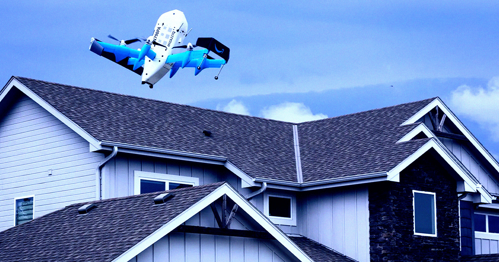

# 亚马逊无人机"精准投递"，把包裹直接掉进了客户泳池

> 德州一位女士跑出门迎接未来配送，结果未来一头扎进了她的游泳池。

 亚马逊说无人机配送是未来，这位客户亲眼见证了未来"扑通"一声。

## 说好的空投，变成了落水

据 ABC7 News 最近分享的一段视频，德州一名女子跑出门，想看看亚马逊 Prime Air 无人机送货的未来长啥样。天上那台大家伙缓缓下降、对准位置，然后——把她包裹精准地砸进了自家泳池，溅起的水花堪比一块巨石砸进马桶。

"哦我的天，哦我的天，"她屏息期待。落水之后："哦靠！"

## 偏偏这时候宣布大扩招

时机讽刺到离谱。就在本周早些时候，亚马逊宣布无人机配送要从现在的11座城市，扩展到全美500多座。结合这台无人机已经展示过的"空中轰炸"实力，这条新闻怎么看都像一份预警。

而且这不是头一回。5月的一段视频里，亚马逊无人机把包裹掉在池塘边，然后滚进水面漂走；去年也有类似事故，包裹直接滚进了客户泳池。水还不是唯一受害者——有人怀疑易碎品会被怎么对待，特意拍了段视频：无人机把一瓶糖浆直接砸在水泥地上，塑料瓶当场摔碎。

## 80磅的"直升机"，还炸过

视频里这台是亚马逊的 MK-30 机型，比消费级无人机大得多，重约80磅。居民抱怨它噪音像直升机，而且确实出过事：去年凤凰城西谷两台 MK-30 撞上工地塔吊、当场起火，亚马逊一度暂停了当地配送。

对于这次落水，亚马逊发言人在声明里 insist 无人机表现"非常出色"："事故极其罕见，当配送不如预期时，我们会从中学习、改进体验，并采取措施防止再发生。"——翻译一下：下次可能还是掉水里，但我们会努力。
