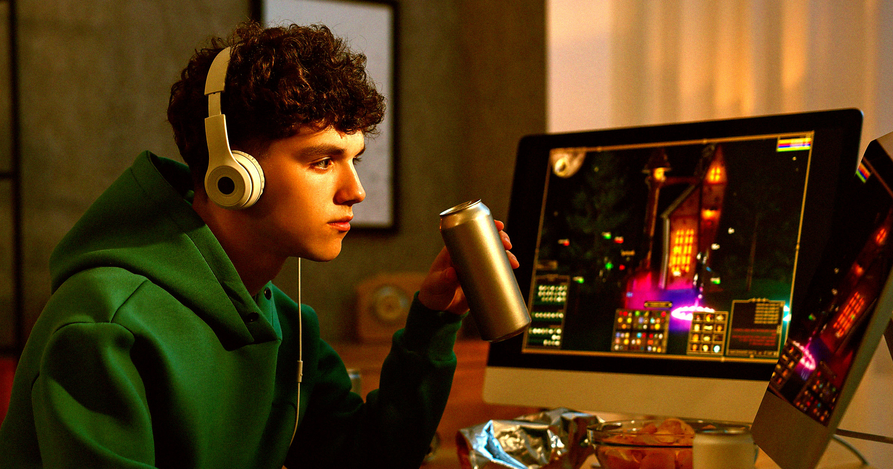

# 新预测市场把直播变成赌局，网友怒吼"这要出内线交易圣经级"

> 一个叫 CRSHMARKET 的平台，让你对直播里任何鸡毛蒜皮下注——连"她Uber两分钟到不到"都开盘。

 当直播也能变成赌盘，普通人的日常就成了庄家的提款机。

## 任何直播，都能开盘

一个新冒头的预测市场 CRSHMARKET，似乎立志要把同行那套 rampant 的内线交易玩出花。平台号称，只要直播里发生的事，几乎都能拿来下注：Twitch 上打游戏的主播、在 Kick 上故意惹众怒的"IRL 播主"，全成了赌徒的素材。

"如果任意一场直播都能变成预测市场呢？"它在一条最近爆火的 X 帖子里发问，配了支短视频广告——"她的 Uber 两分钟内到吗？他能要到她电话吗？下一个球谁进？"

公司还补了一句：这些是"史上从未有过的市场，直到现在"。

## 网友炸了：这是内线交易和洗钱的温床

之所以"以前没有"，大概率是有原因的。CRSHMARKET 这条带着引战意味的营销帖，成功把网友气得七窍生烟——大家都看穿了它轻易就能操纵、做假赌局。

"这种东西必须立法禁止，"有人写道。另一条评论更狠："这马上就会催生圣经级别的内线交易和洗钱。"

面对指控，CRSHMARKET 唯一的保证是回了一句："这个我们搞定了 :)"

真搞得定吗？直播主想作弊太容易了——故意演一出、或者提前通风报信朋友下一秒要发生什么，赌局就稳了。连 Polymarket 那种真实世界大事件都拦不住政府和军方内鬼靠信息牟利，直播这种 stakes 更低、更容易被忽视的场子，只会更乱。

## 21岁创始人的"黑历史"

需要说明的是，这平台到底多正经还两说——除了最近这条爆帖，它几乎没啥真实媒体曝光。但它确实是个真实存在、只是很脏的服务。

其 CEO 兼联合创始人 Evan Rama 才21岁，此前做过一档"大学生真人相亲秀" KupidTV。据德州大学达拉斯分校校报 The Mercury 报道，KupidTV 正因疑似对拒绝收购的竞争对手发动机器人攻击而被起诉。今年4月，Rama 宣布 KupidTV 改名成了 CRSHMARKET。

本周早些时候，Rama 在 LinkedIn 上称 CRSHMARKET 仅用45天交易量就破了1000万美元，随后又在 X 上炫耀团队"已经掌握了爆款密码"。
