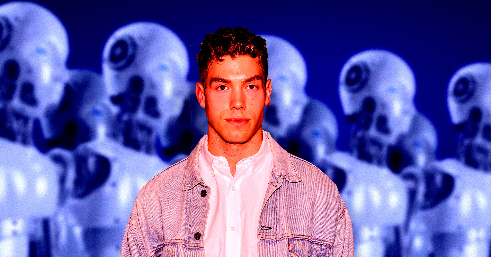

# 用假AI网红钓用户，约会App Goose翻车：联合创始人闪辞走人

> 同性约会应用 Goose 被曝用AI生成的假网红账号诱骗男性注册，联合创始人 Derek Chadwick 突然宣布离开公司。

 一款主打"真爱"的约会应用，口碑却建立在一群不存在的人身上。

## 一条意味深长的告别

据 Out 杂志报道，新兴同性约会应用 Goose 的联合创始人 Derek Chadwick，本周二在 Instagram 上突然宣布离岗。这位本身就是拥有数百万粉丝的模特兼网红写道："一些个人消息。上周起，我已经离开了Goose。这不是一个轻易做出的决定。为我们的社区打造产品，是我做过的最有意义的事情之一。"

至于原因，他说得相当含糊："我关于它该往哪走的愿景，和公司实际的方向，已经不再是同一回事。当我的名字和脸都挂在一样东西上时，我希望自己能完完全全地为它背书。一旦做不到，留下来就感觉不对了。"

把字里行间翻译过来就是：他在急着跟这摊事撇清关系。

## 冲上榜单靠的是一群"不存在的人"

Goose 把自己包装成行业霸主 Grindr 的替代品——后者以约炮文化著称，而 Goose 承诺的是认真交往、甚至命中注定的爱情。再加上创始人本人自带流量、社媒营销打得亲密感人，这款应用一路冲到了 App Store 排行榜前列。

但据 Wired 上个月的一项调查，这波口口相传的热度很大程度上建立在一个谎言之上：Goose 在 Instagram 上养了一批假账号，专门用来勾引毫不知情的男性下载注册。这些账号的关注数与粉丝数比例高得可疑，头像一眼就能看出是AI生成的。

手段还相当下本钱。有的假号会主动私信男性用户，再把对方加进自己的"密友动态"——在那里，一个AI深度伪造出来的帅哥嘘寒问暖，让目标误以为自己正在被拉进某个专属小圈子，而入会的方式只有一个：下载 Goose。

## 官方回应：感谢，然后没有了

Goose 方面向 Out 确认了 Chadwick 的离职："随着 Goose 进入下一个增长阶段，Derek Chadwick 已卸任联合创始人一职。我们感谢 Derek 为公司带来的领导力和愿景，以及他帮助打下的基础。"至于假账号风波，一个字都没提。

有点讽刺的是，这款教别人寻找真爱的应用，最擅长的技能竟然是批量制造假人。等热度退潮，池子里剩下的，恐怕只有那些真心实意想在手机上找个人聊聊的普通用户。
